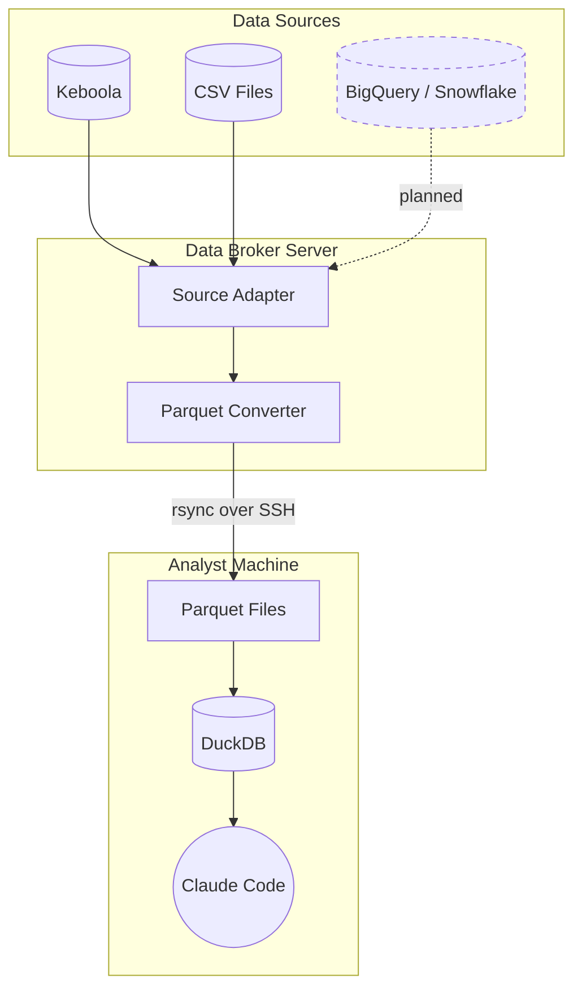

# AI Data Analyst

A data distribution platform for AI analytical systems. It pulls data from configured sources, converts it to Parquet format, and distributes it to analysts who query it locally using Claude Code and DuckDB.

## How It Works



1. The server fetches data from a configured source using the appropriate adapter.
2. Raw data is converted to typed, columnar Parquet files.
3. Analysts sync Parquet files to their machines over SSH (rsync).
4. Claude Code queries the local DuckDB database and returns results with insights.

## Features

- **Pluggable data sources** -- connector interface supporting Keboola out of the box, CSV import, and extensible to BigQuery, Snowflake, and others.
- **Pluggable authentication** -- auto-discovered auth providers (Google OAuth, email/password, desktop JWT, or custom).
- **Automatic Parquet conversion** -- source data is converted to typed, partitioned Parquet files for efficient local querying.
- **SSH-based distribution** -- analysts sync data securely via rsync; no cloud credentials leave the server.
- **Claude Code as analyst interface** -- natural language queries against DuckDB, powered by Claude.
- **Claude Code as installer** -- the CLAUDE.md file guides Claude Code through automated project setup for new analysts.
- **Self-service webapp** -- web UI for user onboarding, SSH key management, sync settings, and data catalog browsing.
- **Corporate Memory** -- shared knowledge base that aggregates analyst insights and distributes approved rules back to the team.
- **Configurable per-instance** -- a single `config/instance.yaml` controls branding, authentication, data source, user mapping, and more.
- **Access control** -- role-based permissions with standard analyst, privileged analyst, and admin tiers.

## Quick Start

See **[docs/QUICKSTART.md](docs/QUICKSTART.md)** for full setup instructions.

The short version:

```bash
# 1. Clone the repository
git clone https://github.com/your-org/ai-data-analyst.git
cd ai-data-analyst

# 2. Copy and edit configuration
cp config/instance.yaml.example config/instance.yaml
cp config/data_description.md.example config/data_description.md
# Edit both files for your environment

# 3. Deploy the server
# See docs/DEPLOYMENT.md for detailed server setup

# 4. Analysts connect via the webapp and sync data
bash server/scripts/sync_data.sh
```

## Project Structure

```
ai-data-analyst/
├── config/                        # Instance configuration
│   ├── instance.yaml.example      # Main config template (copy to instance.yaml)
│   └── data_description.md.example  # Data schema template
│
├── src/                           # Core data sync engine (vendor-neutral)
│   ├── data_sync.py              # Orchestrates data pull + DataSource ABC
│   ├── parquet_manager.py        # CSV to Parquet conversion
│   ├── config.py                 # Configuration loader
│   └── profiler.py               # Data profiling for catalog
│
├── connectors/                    # Data source connectors (pluggable)
│   ├── keboola/                   # Keboola Storage connector
│   │   ├── adapter.py            # KeboolaDataSource (implements DataSource)
│   │   └── client.py             # Low-level Keboola API client
│   └── jira/                      # Jira webhook connector
│
├── auth/                          # Authentication providers (pluggable)
│   ├── google/                    # Google OAuth provider
│   ├── password/                  # Email/password provider
│   └── desktop/                   # Desktop JWT provider (API-only)
│
├── services/                      # Standalone services (own systemd units)
│   ├── telegram_bot/              # Telegram notification bot
│   ├── ws_gateway/                # WebSocket notification gateway
│   ├── corporate_memory/          # AI knowledge aggregation
│   └── session_collector/         # Claude Code session collector
│
├── webapp/                        # Flask web application
│   └── ...                        # User onboarding, settings, catalog
│
├── server/                        # Deployment infrastructure only
│   ├── deploy.sh                  # Deployment script (auto-discovers services)
│   └── ...                        # Sudoers, nginx, setup scripts
│
├── scripts/                       # Helper scripts
│   ├── sync_data.sh              # Sync data from server
│   ├── setup_views.sh            # Initialize DuckDB views
│   └── dev_run.py                # Dev server with auth bypass
│
├── docs/                          # User-facing documentation
├── dev_docs/                      # Developer and operator documentation
├── tests/                         # Test suite
├── requirements.txt               # Python dependencies
├── CLAUDE.md                      # Instructions for Claude Code
└── README.md                      # This file
```

## Supported Data Sources

| Adapter | Status | Description |
|---------|--------|-------------|
| Keboola Storage | Available | Pulls tables via the Keboola Storage API |
| CSV | Planned | Imports local or mounted CSV files |
| BigQuery | Planned | Google BigQuery adapter |
| Snowflake | Planned | Snowflake adapter |

Adding a new data source means creating a connector module in `connectors/` that implements the `DataSource` interface from `src/data_sync.py`, and setting `data_source.type` in `config/instance.yaml`. See `connectors/keboola/` for a reference implementation.

## Using with Claude Code

Once data is synced, open Claude Code in the project directory and ask questions in natural language:

```
What are the top 10 customers by revenue this quarter?
```

```
Show me the trend in support ticket volume over the last 6 months.
```

Claude Code will connect to the local DuckDB database, write and execute SQL, and return results with analysis.

## Documentation

- **[Architecture](ARCHITECTURE.md)** -- System components, data flow, and key patterns
- **[Quick Start](docs/QUICKSTART.md)** -- End-to-end setup for new deployments
- **[Configuration](docs/CONFIGURATION.md)** -- All configuration options explained
- **[Deployment](docs/DEPLOYMENT.md)** -- Server provisioning and deployment guide
- **[Data Sources](docs/DATA_SOURCES.md)** -- How to configure and extend data source adapters
- **[Server Administration](dev_docs/server.md)** -- Day-to-day server operations
- **[Security](dev_docs/security.md)** -- Access control and security model

## License

This project is licensed under the [MIT License](LICENSE).

---

Questions or issues? Open a GitHub issue.
