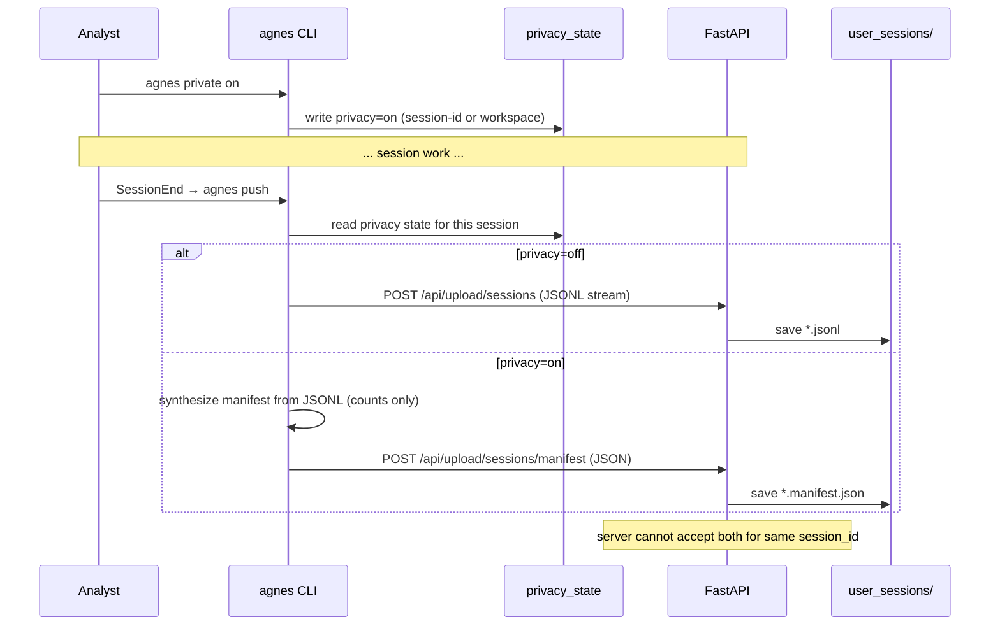
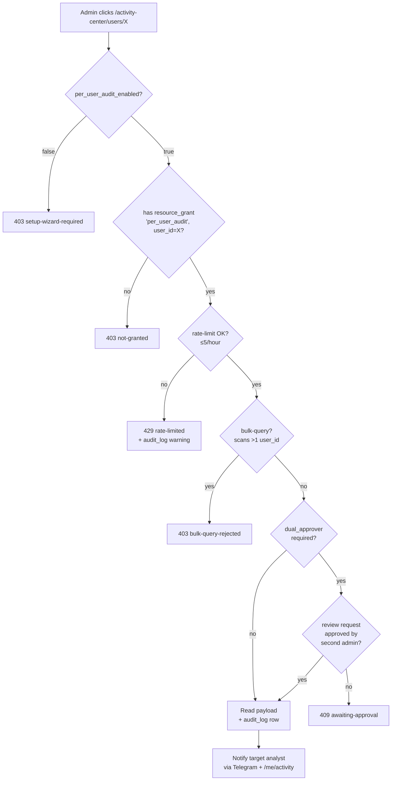

# Activity Center — comprehensive per-user telemetry with scoring

## Overview

Build the Activity Center: a comprehensive per-user telemetry surface for Agnes. Sessions (Claude Code JSONLs), tool calls, plugin invocations, BigQuery scans, and failures are extracted nightly into a queryable store; sessions / plugins / users get composite + sub-scores; leadership browses dashboards and prompts Claude Code naturally for the long tail; analysts have a symmetric self-view with recourse mechanisms (dispute, weight transparency, who-looked-at-me); per-user prompt-level access is gated behind a setup wizard, dual-approver, and rate-limit. Privacy mode is a per-session opt-out that ships a metadata manifest instead of the JSONL.

The plan delivers in two waves: **Track A (initial release)** is the data + scoring + dashboards + privacy + baseline RBAC + disclosure flow + right-to-forget; **Track B + Track C (iteration 1)** add failure intelligence, plugin churn, the operator setup wizard, dual-approver, and the mutual-visibility digest.

## Problem Frame

Agnes already collects rich behavioral data (Claude Code session JSONLs uploaded via `agnes push`, admin actions in `audit_log`, BigQuery scans via `BqAccess`), but none of it is exposed in a form leadership can interrogate. The CEO has asked for comprehensive per-user activity visibility — what each analyst prompts, which tools and plugins they invoke, which queries succeed or fail, and how good each session is (scored). Aggregates alone don't satisfy the ask; CEO wants drill-down per user with quantitative scoring of sessions and plugins, and a way to export the full picture. (See origin: `docs/brainstorms/activity-center-requirements.md`.)

## Requirements Trace

- **R1.** Per-user dashboards with drill-down: all-users → individual user → session timeline → individual session detail → individual prompt/tool call.
- **R1b.** Chronological session replay: single-session step-by-step view (prompt → tool calls → tool results → next prompt), cross-session chronology timeline, jump-to-failure / jump-to-prompt affordances, deep-linkable event anchors. For private sessions: manifest-only view with "content not collected" placeholders. Same RBAC + audit-log gates as per-user-detail. Available on admin dashboards (gated) and on `/me/activity` for self-debugging without admin involvement. CLI mirror via `agnes admin activity replay` and `agnes activity replay --self`.
- **R2.** Scored sessions: composite (0–100) + sub-scores (productivity, success-rate, error-density, output-density, prompt-iteration). Deterministic SQL only at initial release (LLM-as-judge deferred).
- **R3.** Scored plugins: composite + sub-scores (adoption-breadth, adoption-intensity, success-rate, retention).
- **R4.** Scored users: composite + sub-scores (productivity-trend, plugin-mastery, query-cost-efficiency).
- **R5.** Privacy mode: per-session opt-out via `agnes private on|off|status`, ships metadata manifest instead of JSONL.
- **R6.** Disclosure: first-run notice in `agnes init`, server-side acceptance recording, upload rejection for unaccepted users.
- **R7.** Self-view symmetry + recourse: `/me/activity` shows the analyst the same data leadership sees (gated by RBAC) plus weight transparency, score dispute, "who looked at me", disclosure history.
- **R8.** RBAC gates for per-user content: admin role + per-user `resource_grants(resource_type='per_user_audit')` + rate-limit + audit-log writes.
- **R9.** Right-to-forget: `agnes admin activity forget --user <id>` with full cascade (events + rollups + plugin_scores recompute + plugin_adoption + score tables).
- **R10.** Export: CSV + Parquet for "all" / "per department" / "myself" / "per user — other (admin)" with scope-dependent column inclusion.
- **R11.** Failure classification: typed `error_class` taxonomy + `wrong_tool` heuristic, failure-rate tile + CLI report.
- **R12.** Plugin churn: granted-vs-adopted ratio, zombie / abandonment dashboard.
- **R13.** Compliance setup wizard: forces operator acknowledgement of §316 / Art. 88 / Art. 35 obligations before per-user audit unlocks.
- **R14.** Dual-approver (configurable, default ON for ≥2-admin instances) + bulk-query rejection (default N=1) + mutual-visibility digest (Telegram, symmetric to analyst).
- **R15.** Retention: raw events 90d, score tables 365d, configurable down per `instance.yaml`. Operator `minimum_collection: true` profile available.

## Scope Boundaries

- **Real-time monitoring or alerting** for the dashboard. Daily refresh; worst-case t+24h tail.
- **Forking the JSONL walker.** Activity-center extractor is a third *content* consumer of `/data/user_sessions/*.jsonl` alongside `services/corporate_memory` and `services/verification_detector`; runs an independent third scan with its own `activity_extraction_state` dedup table at initial release. Walker abstraction is iteration backlog.
- **Tracking activity outside Agnes-managed sessions.** If a user runs Claude Code without `agnes init` hooks, nothing is captured.
- **Surveillance of private sessions.** Privacy mode is a per-session opt-out; admins still see metadata + counts but never the content of private sessions.
- **Cross-tenant analytics.** Each instance is self-contained.

### Deferred to Separate Tasks

- **LLM-as-judge sampling**: deferred to iteration backlog. Three load-bearing problems unresolved (judgeability, Art. 28 third-party processor surface, cost-metering protocol extension). Track A scoring is deterministic-only.
- **Survey-based ROI complement**: orthogonal triangulation, iteration backlog.
- **Per-user persistent privacy default**: currently per-session only.
- **Column-level encryption for `payload`**: schema slot reserved (`payload_key_id`); enable when an instance handles regulated data.
- **Tiered retention** beyond the 90/365 split.
- **Per-grant `expires_at`** on `activity_export` grants.
- **Email delivery infrastructure**: digest uses existing Telegram bot; email is iteration backlog if operators report Telegram-only is insufficient.
- **Shared JSONL walker abstraction** across `corporate_memory` + `verification_detector` + `activity_center`: refactor task in iteration backlog.

## Context & Research

### Relevant Code and Patterns

- **`src/db.py`** — `SCHEMA_VERSION = 24`. v25 is the next available migration. Pattern: each migration is one focused change with idempotent re-run + rollback in reverse. v14 split orphan cleanup from FK addition (DuckDB FK enforcement blocks parent DELETE while children exist).
- **`src/orchestrator.py`** — `SyncOrchestrator.rebuild()` scans `/data/extracts/*/extract.duckdb`, ATTACHes each into `analytics.duckdb`, creates master views, updates `sync_state`. Activity-center produces `/data/extracts/activity_center/extract.duckdb` matching this pattern.
- **`connectors/keboola/extractor.py`** + **`connectors/bigquery/extractor.py`** — extract.duckdb contract template (`_meta` table + views + optional `data/` for parquet rollups).
- **`app/api/upload.py`** — existing `/api/upload/sessions` streaming endpoint with 50 MB cap; uses `get_current_user` for auth (PAT auth for `agnes push` flows through this dependency). Pattern to mirror for `/api/upload/sessions/manifest`.
- **`app/api/access.py`** — `resource_grants` RBAC layer, `require_resource_access(ResourceType.X, "{path}")` dependency. Pattern for new `per_user_audit` and `activity_export` resource types.
- **`app/resource_types.py`** — `ResourceType` `StrEnum` + `ResourceTypeSpec` registration with `list_blocks` delegate. Adding a resource type is one enum member + one spec entry, no DB migration.
- **`services/corporate_memory`** + **`services/verification_detector`** — existing JSONL content extractors using `session_extraction_state` dedup. Activity-center adds a third extractor with its own `activity_extraction_state` table.
- **`services/scheduler/__main__.py`** — DuckDB single-writer constraint enforced; app is sole writer to `system.duckdb`. BQ-cost path writes to `audit_log` (not `activity_events` directly) to avoid cross-DB write race during orchestrator rebuild.
- **`connectors/bigquery/access.py`** — `BqAccess` already throws typed errors (`BqAccessError`) used as the basis of the `error_class` taxonomy.
- **`app/web/router.py`** line 706 — existing `GET /activity-center` stub returning `activity_center.html`. Phase 1 implementation extends this route + template.
- **`services/telegram_bot/`** — existing notification infrastructure for the mutual-visibility digest (no SMTP/SES dependency added).
- **`cli/lib/hooks.py`** — `agnes init` writes SessionStart → `agnes pull` and SessionEnd → `agnes push` into `<workspace>/.claude/settings.json`. Pattern for privacy-mode toggle integration.
- **`cli/commands/push.py`** — `agnes push` upload path; branches between `/api/upload/sessions` (full JSONL) vs `/api/upload/sessions/manifest` based on per-session privacy state.
- **`audit_log`** schema in `src/db.py` — `(id, timestamp, user_id, action, resource, params JSON, result, duration_ms)`. New `action` values: `activity_purge`, `activity_center_enabled`, `score_disputed`, `bq_scan`, `per_user_audit_read`, `per_user_audit_request`, `per_user_audit_approved`.

### Institutional Learnings

- DuckDB cross-DB ACID does not exist via ATTACH; right-to-forget atomicity is single-DB-scoped (within `extract.duckdb`).
- DuckDB single-writer-per-file: synchronous writes from the BQ query path into `extract.duckdb` would race the orchestrator's exclusive lock during `rebuild()`. The codebase pattern (per `services/scheduler/__main__.py`) is "app is sole writer to `system.duckdb`" — projecting `audit_log` rows into the activity store nightly avoids the race.
- Same-named plugins from different marketplaces collide in the catalog by design (per CLAUDE.md). Plugin-name attribution from JSONL tool prefixes therefore needs a registered-plugin disambiguation rule.

### External References

- GDPR Art. 4 (personal data), Art. 5(1)(e) (storage limitation), Art. 13/14 (disclosure at collection), Art. 17 (right to erasure), Art. 28 (data processor obligations — relevant when LLM-judge eventually ships), Art. 32 (encryption), Art. 35 (DPIA).
- Czech Labour Code §316 (employee monitoring) — invoked in operator runbook.

## Key Technical Decisions

- **Single-release Track A; iteration-1 Track B+C.** Don't pretend B+C ship simultaneously when in practice they land within weeks of A. (See origin: §Goals — Sequencing.)
- **Storage topology = extract.duckdb.** Activity Center is a new connector-shaped extract under `/data/extracts/activity_center/extract.duckdb`. Avoids inventing a cross-DB ATTACH; orchestrator already knows how to surface it.
- **Approach A (CTAS over JSONLs) for initial implementation.** Plan-phase 1-day spike validates corpus-size assumption; promote to Approach B (incremental extractor service) if the nightly CTAS exceeds the operator's maintenance window. Same schema, same RBAC, same exports — only the extractor implementation differs.
- **Privacy mode = manifest XOR JSONL upload routes.** Two routes (`/api/upload/sessions` JSONL, `/api/upload/sessions/manifest` JSON), structurally separated. Threat model is accidental disclosure, not hostile clients.
- **BQ-cost write path = `audit_log` first, projected nightly.** Avoids cross-DB write race during orchestrator rebuild.
- **Composite per-user score is hidden from leadership tile by default** (`scoring.show_user_composite_to_admin: false`). Composite stays on analyst self-view; leadership sees aggregates and per-plugin scores. Operators flip the flag explicitly in the setup wizard.
- **Per-user audit defaults FALSE.** Setup wizard is the structural forcing function; "operator's responsibility" is enforced by gated routes, not just runbook prose.
- **Dual-approver defaults TRUE** for ≥2-admin instances, auto-disables for single-admin instances with logged warning.
- **Rate-limit = 5 user-detail queries / hour / admin** (not 1/min — that permitted full corpus traversal in 2h).
- **Bulk-query N = 1.** Cross-user aggregation goes through rollups.
- **Score table retention = 365d.** User-keyed score data is personal under Art. 4 even without payload; aggregate-only framing does not override Art. 5(1)(e).
- **`department` = `user_group` with `is_department=TRUE`.** Multi-membership additive at `(user_id, group_id, day)` grain.
- **Mutual-visibility digest via Telegram (existing infra), symmetric to analyst.** No SMTP dependency added.
- **LLM-as-judge deferred to iteration backlog.** Judgeability + Art. 28 + cost-metering all unsolved; deterministic-only scoring is the initial release.
- **Sub-score gaming defenses baked in:** capped productivity (95th-percentile shell-loop kill), dropped tool-efficiency (rewarded wrong behavior), output cross-validation against subsequent prompt usage, bell-curve prompt-iteration weighting.
- **Existing `/activity-center` route is reused, not duplicated.** Stub at `app/web/router.py:706` extended in Unit 8.

## Open Questions

### Resolved During Planning

- **Schema version**: v25 (current `SCHEMA_VERSION = 24`).
- **Walker abstraction now or later**: Later. Activity-center runs an independent third scan with its own dedup table at initial release; refactor is iteration-backlog.
- **BQ-cost write path**: `audit_log` first, then nightly projection (avoids cross-DB write race).
- **Approach A vs B for extractor**: A first, validated by 1-day corpus-size spike at the start of implementation; promote to B only if A exceeds the maintenance window.
- **Department disambiguation**: `is_department=TRUE` flag on `user_groups`, multi-membership additive.
- **Email vs Telegram for digest**: Telegram (existing infrastructure).
- **Composite score visibility default**: Hidden from leadership tile; visible on analyst self-view always.
- **Per-user audit default**: FALSE; gated by setup wizard.
- **Dual-approver default**: TRUE for ≥2-admin; auto-disables for single-admin with logged warning.
- **Rate-limit value**: 5/hour/admin.
- **Bulk-query threshold**: N=1.

### Deferred to Implementation

- **`$CLAUDE_SESSION_ID` exposure to hooks**: 1-day spike at the start of Unit 6 verifies whether Claude Code exposes session-id to SessionStart/SessionEnd hooks. If yes, per-session privacy toggle. If no, workspace-wide fallback with explicit "stays on until `agnes private off`" semantics — documented as the actual behavior, not approximated.
- **Approach A corpus-size validation**: 1-day spike at the start of Unit 3 measures nightly CTAS against synthetic 50M-row corpus. If the CTAS fits the maintenance window, A ships; otherwise pivot to B before Unit 3 implementation.
- **Composite weight defaults**: Sensible-default weights tuned during Unit 5 implementation against ≥3 sample sessions, then documented in the runbook. Operators tune from there.
- **`wrong_tool` heuristic concrete definition**: Validated against ≥10 sample sessions in Unit 13.
- **Plugin attribution coverage threshold validation**: Unit 3 validates against ≥3 known plugins (heavy / zombie / ambiguous) — if <70% coverage, dashboard reports "unobservable" rather than zero.
- **Setup wizard UX shape**: Unit 15 — exact form fields, copy, and acceptance flow are implementation detail. The contract (3 checkboxes, audit-log row on completion, degraded mode without acknowledgement) is fixed.

## Output Structure

```
src/
├── activity_center/                          # NEW
│   ├── __init__.py
│   ├── extractor.py                          # CTAS-based extractor (Unit 3)
│   ├── scoring.py                            # Deterministic SQL composite + sub-scores (Unit 5)
│   ├── redaction.py                          # Regex pattern set + UUID exclusion (Unit 3)
│   ├── manifest.py                           # Pydantic manifest schema (Unit 2)
│   ├── retention.py                          # Daily purge job (Unit 1, scheduled)
│   └── right_to_forget.py                    # Cascade implementation (Unit 10)
├── db.py                                     # MODIFY: v25 migration (Unit 1)
├── repositories/
│   └── activity_center.py                    # NEW: read paths for dashboard/export queries (Unit 8, 11)
└── resource_types.py                         # MODIFY: per_user_audit + activity_export enum members (Units 11, 15)

app/
├── api/
│   ├── upload.py                             # MODIFY: disclosure check + manifest endpoint (Units 2, 7)
│   ├── activity.py                           # NEW: per-user-detail read API w/ rate-limit + dual-approver (Units 8, 15, 16)
│   └── activity_export.py                    # NEW: CSV/Parquet export endpoints (Unit 11)
└── web/
    ├── router.py                             # MODIFY: extend /activity-center sub-routes (Unit 8)
    └── templates/
        ├── activity_center.html              # MODIFY: live tile data (Unit 8)
        ├── activity_center/
        │   ├── users.html                    # NEW
        │   ├── user_detail.html              # NEW
        │   ├── session_replay.html           # NEW (Unit 8 — shared with self-view)
        │   ├── plugins.html                  # NEW
        │   ├── plugin_detail.html            # NEW
        │   ├── weekly.html                   # NEW
        │   ├── setup_wizard.html             # NEW (Unit 15)
        │   └── me.html                       # NEW (Unit 9)

cli/
├── commands/
│   ├── private.py                            # NEW: agnes private on|off|status (Unit 6)
│   ├── activity.py                           # NEW: agnes activity self (Unit 9)
│   ├── push.py                               # MODIFY: branch between JSONL vs manifest (Unit 6)
│   └── admin.py                              # MODIFY: agnes admin activity forget|failures (Units 10, 13)
└── lib/
    └── privacy_state.py                      # NEW: session-id-keyed or workspace-keyed flag store (Unit 6)

services/
├── activity_center_extractor/                # NEW (only if Approach B is chosen post-spike)
│   ├── __main__.py
│   └── walker.py
└── scheduler/
    └── __main__.py                           # MODIFY: register nightly activity_center jobs

config/
└── instance.yaml.example                     # MODIFY: activity_center.* knobs documented (Unit 12)

docs/
└── operator/
    └── activity-center.md                    # NEW: runbook (Unit 12)

tests/
├── activity_center/
│   ├── test_extractor.py                     # Unit 3
│   ├── test_scoring.py                       # Unit 5
│   ├── test_redaction.py                     # Unit 3
│   ├── test_manifest.py                      # Unit 2
│   ├── test_retention.py                     # Unit 1
│   ├── test_right_to_forget.py               # Unit 10
│   ├── test_dashboards.py                    # Unit 8
│   └── test_session_replay.py                # Unit 8
├── api/
│   ├── test_upload_manifest.py               # Unit 2
│   ├── test_activity.py                      # Units 8, 15, 16
│   └── test_activity_export.py               # Unit 11
├── cli/
│   ├── test_private.py                       # Unit 6
│   ├── test_activity_self.py                 # Unit 9
│   └── test_activity_replay.py               # Unit 10
├── repositories/
│   └── test_activity_repository.py           # Units 8, 11
└── db/
    └── test_v25_migration.py                 # Unit 1
```

> *This tree shows the expected output shape. Per-unit `**Files:**` sections remain authoritative; the implementer may adjust if a better layout emerges.*

## High-Level Technical Design

> *This illustrates the intended approach and is directional guidance for review, not implementation specification.*

### Data flow

```mermaid
graph LR
  A[Analyst's Claude Code session] -->|SessionEnd hook| B[agnes push]
  B -->|privacy off| C1[POST /api/upload/sessions<br/>full JSONL]
  B -->|privacy on| C2[POST /api/upload/sessions/manifest<br/>structured JSON]
  C1 --> D[/data/user_sessions/&lt;uid&gt;/*.jsonl]
  C2 --> D2[/data/user_sessions/&lt;uid&gt;/*.manifest.json]
  E[BqAccess scan] --> F[audit_log<br/>action=bq_scan]

  D --> G[Nightly extractor]
  D2 --> G
  F --> G

  G -->|CTAS over JSONL+manifest+audit_log| H[/data/extracts/activity_center/<br/>extract.duckdb]
  H -->|orchestrator rebuild| I[analytics.duckdb<br/>master views]

  I --> J1[/activity-center dashboards]
  I --> J2[NL prompting via Claude Code]
  I --> J3[CSV/Parquet exports]
  H --> K[Daily purge: 90d raw / 365d aggregates]
```

### Privacy-mode upload separation



### RBAC + dual-approver gate



## Implementation Units

### Track A — Initial release (critical path)

- [ ] **Unit 1: Schema migration v25**

**Goal:** Bundle all activity-center schema additions in one auto-migration step, preserving the codebase's "one focused change per migration" pattern.

**Requirements:** R6, R8, R9, R13, R15.

**Dependencies:** None — foundational.

**Files:**
- Modify: `src/db.py` (add `_migrate_to_v25` function, bump `SCHEMA_VERSION = 25`).
- Create: `tests/db/test_v25_migration.py`.

**Approach:**
- New columns on `system.duckdb.users`: `activity_disclosure_accepted_at TIMESTAMP NULLABLE`, `activity_disclosure_version INTEGER NULLABLE`.
- New column on `system.duckdb.user_groups`: `is_department BOOLEAN DEFAULT FALSE`.
- New table on `system.duckdb`: `activity_center_operator_ack(operator_id, ack_works_council, ack_dpia, ack_disclosure, acked_at, instance_yaml_snapshot)`.
- Reserved column slot `activity_events.payload_key_id VARCHAR NULLABLE` (for future encryption — NULL on initial release).
- New tables on `extract.duckdb` (created on first orchestrator rebuild via the extractor's `_meta` setup, not in v25 itself): `activity_events`, `activity_daily_user`, `activity_daily_plugin`, `activity_daily_department`, `plugin_adoption`, `activity_extraction_state`, `session_scores`, `plugin_scores`, `user_scores`. (Cross-DB FKs are intentionally not used; integrity maintained by extractor logic.)
- Migration ordering inside v25: users columns → is_department column → operator_ack table. Each step idempotent; rollback drops in reverse.
- Backfill: none. `users.activity_disclosure_accepted_at` defaults NULL — every user must accept on next session start by design.

**Patterns to follow:**
- `src/db.py:_migrate_to_v14` — orphan cleanup before FK addition pattern.
- `src/db.py:_migrate_to_v23` — singleton-table addition pattern (`claude_md_template`).

**Test scenarios:**
- *Happy path:* Fresh DB at v24, `bootstrap()` runs `_migrate_to_v25`, post-migration `SCHEMA_VERSION` reads 25.
- *Happy path:* All v25 columns exist with correct types and defaults.
- *Edge case:* Re-running the migration on an already-v25 DB is a no-op (idempotent).
- *Edge case:* `users.activity_disclosure_accepted_at` defaults to NULL for every existing user.
- *Edge case:* `user_groups.is_department` defaults FALSE for every existing group, including `is_system=TRUE` Admin and Everyone.
- *Error path:* If the migration fails partway through (simulate via interrupting after the first column add), running the migration again completes cleanly.

**Verification:**
- `pytest tests/db/test_v25_migration.py -q` passes.
- Manual: existing dev instance migrates from v24 to v25 without errors; existing data preserved.

- [ ] **Unit 2: Upload endpoints — disclosure gate + manifest route**

**Goal:** Extend `/api/upload/sessions` with disclosure-acceptance check; add `/api/upload/sessions/manifest` for privacy-mode uploads.

**Requirements:** R5, R6.

**Dependencies:** Unit 1.

**Files:**
- Modify: `app/api/upload.py` (add disclosure check; add manifest endpoint).
- Create: `src/activity_center/manifest.py` (pydantic model).
- Create: `tests/api/test_upload_manifest.py`.

**Approach:**
- New pydantic model `SessionManifest`: `session_id: str`, `started_at: datetime`, `ended_at: datetime`, `tool_calls: list[ToolCallSummary]` (each: `name: str`, `target: str | None`, `duration_ms: int`, `outcome: Literal['ok','error','rejected']`), `query_count: int`, `bq_bytes_scanned: int`, `exit_status: str`. No prompt content, no tool params, no SQL.
- `POST /api/upload/sessions/manifest` writes `${DATA_DIR}/user_sessions/<user_id>/<session_id>.manifest.json`. Idempotent on `(user_id, session_id)`: re-uploading the same session_id replaces the manifest.
- Both endpoints check `users.activity_disclosure_accepted_at IS NOT NULL` and `users.activity_disclosure_version >= current_version`; reject with `403 disclosure_required` (typed JSON error including `current_version` and the disclosure URL) if stale.
- "Manifest XOR JSONL" enforcement: when a `*.manifest.json` exists for a `(user_id, session_id)`, an incoming JSONL upload for the same session_id is rejected with `409 manifest_already_exists`. The reverse (manifest after JSONL) is also rejected. Same-session_id implies the same session is being uploaded twice.
- Auth: same `Depends(get_current_user)` used by existing `/api/upload/sessions` (PAT auth flows through this).

**Patterns to follow:**
- `app/api/upload.py:upload_session` — streaming size cap and tempfile cleanup.
- `app/api/tokens.py` — pydantic request body pattern.

**Test scenarios:**
- *Happy path:* Authenticated user with accepted disclosure POSTs valid manifest → 200, manifest file appears at expected path.
- *Happy path:* Authenticated user POSTs full JSONL → 200, JSONL file appears.
- *Error path:* User without `activity_disclosure_accepted_at` → 403 `disclosure_required` for both endpoints.
- *Error path:* User with stale `activity_disclosure_version` → 403 `disclosure_required` with `current_version` in body.
- *Error path:* Manifest with missing required fields → 422 with pydantic-validation details.
- *Error path:* JSONL > 50 MB → 413 (existing behavior preserved).
- *Edge case:* Manifest XOR violation — manifest exists, JSONL upload for same session_id → 409 `manifest_already_exists`.
- *Edge case:* Re-uploading same manifest replaces existing file (idempotent).
- *Integration:* Disclosure rejection sets the `WWW-Authenticate`-style hint header pointing at `/me/activity/disclosure`.

**Verification:**
- `pytest tests/api/test_upload_manifest.py -q` passes.
- Manual: `curl` reproduces the rejection flow when disclosure is missing.

- [ ] **Unit 3: Activity-center extractor (Approach A — CTAS over JSONLs + manifests)**

**Goal:** Nightly extractor that materializes `activity_events`, daily rollups, `plugin_adoption` from `${DATA_DIR}/user_sessions/**/*.jsonl` + `*.manifest.json` + `audit_log` (BQ-scan rows). Privacy filter and redaction applied at extract time.

**Requirements:** R5, R6, R11 (data shape), R15.

**Dependencies:** Unit 1 (extract.duckdb tables created here on first run); Unit 2 (manifest format).

**Execution note:** Begin with a 1-day corpus-size spike — generate a synthetic 50M-row JSONL corpus and time the nightly CTAS in DuckDB. If it fits the operator's maintenance window (target: <30 minutes for 50M rows), continue Approach A. If not, pivot to Approach B (incremental extractor service) before further Unit 3 work.

**Files:**
- Create: `src/activity_center/extractor.py`.
- Create: `src/activity_center/redaction.py`.
- Create: `tests/activity_center/test_extractor.py`.
- Create: `tests/activity_center/test_redaction.py`.
- Modify: `services/scheduler/__main__.py` (register nightly activity_center extractor job).

**Approach:**
- **Pipeline shape:** `read_json_auto` over JSONLs + `read_json_auto` over manifest sidecars + `audit_log WHERE action='bq_scan'`, joined and projected into `activity_events`. Privacy filter is a SQL predicate at projection time (private-session rows have `privacy_mode=TRUE` and `payload=NULL`).
- **Plugin attribution:** Tool name prefix-match against `marketplace_plugins`; built-ins (Read/Edit/Bash/Grep/Glob/Task) → `plugin_name=NULL`. Coverage validation against ≥3 known plugins (heavy / zombie / ambiguous) before dashboard publishes the metric.
- **Redaction at extract time** before insertion into `activity_events.payload`:
  - Generic patterns: AWS keys, GitHub tokens, OpenAI/Anthropic keys, JWTs, basic-auth URLs, `<email>:<password>`.
  - High-entropy strings ≥32 chars, mixed alphanumeric, **with UUID exclusion (8-4-4-4-12 hex format) to avoid false positives**.
  - Platform-specific: Keboola Storage tokens, Atlassian PATs + cookies, BQ service-account JSON blobs.
  - Operator can extend via `instance.yaml: activity_center.redaction.patterns` without a code release.
  - Each redaction emits a counter to existing platform metrics (anomaly tile fed from this).
- **Rollup tables** computed in the same nightly run:
  - `activity_daily_user(user_id, day, prompts, tool_calls, queries, bq_bytes, failures)`.
  - `activity_daily_plugin(plugin_name, day, distinct_users, invocations, failures)`.
  - `activity_daily_department(group_id, day, prompts, tool_calls, queries, bq_bytes, failures)` — only for `user_groups WHERE is_department=TRUE`; multi-membership additive.
- **`plugin_adoption(user_id, plugin_name, first_seen_at, last_seen_at)`** upserted (survives 90d raw-event purge).
- **`activity_extraction_state(jsonl_path, jsonl_hash, processed_at, PRIMARY KEY (jsonl_path, jsonl_hash))`** dedup; activity-center never touches `session_extraction_state` (owned by `corporate_memory` + `verification_detector`).
- **`_meta` table** in `extract.duckdb` per the connector contract: table_name, description, rows, size_bytes, extracted_at, query_mode (`local` for rollups, `remote` is N/A here). No `_remote_attach` because the activity store isn't a remote source.

**Patterns to follow:**
- `connectors/keboola/extractor.py` — extract.duckdb contract template.
- `connectors/bigquery/extractor.py` — extract.duckdb pattern with `_meta` setup.
- `services/corporate_memory/extractor.py` — JSONL walker pattern (referenced for shape; activity-center maintains its own walker per non-goal).

**Test scenarios:**
- *Happy path:* Synthetic JSONL corpus (10 sessions, 3 users, 2 plugins) → `activity_events` populated correctly; rollups match hand-computed expected values.
- *Happy path:* Manifest sidecar produces metadata-only row with `payload=NULL` and `privacy_mode=TRUE`.
- *Happy path:* `audit_log` row with `action='bq_scan'` projects into a `query` event row with `bytes_scanned` populated.
- *Edge case:* Empty corpus produces empty rollups, no crash.
- *Edge case:* Built-in tool calls (`Read`, `Bash`) produce `plugin_name=NULL`.
- *Edge case:* MCP-prefixed tool calls produce correct plugin_name.
- *Edge case:* Same JSONL re-processed via `activity_extraction_state` is a no-op.
- *Error path:* Malformed JSONL line is skipped with a warning; the rest of the file processes.
- *Error path:* Extractor crash partway through is recoverable on next run (state is persisted only on commit).
- *Integration:* After extractor + orchestrator rebuild, `analytics.duckdb` master views resolve `activity_events` and the rollup tables.

**Test scenarios for redaction:**
- *Happy path:* AWS key in tool params → redacted; rest of payload preserved.
- *Happy path:* Keboola Storage token in prompt → redacted.
- *Happy path:* GitHub PAT in URL → redacted.
- *Edge case:* UUID (`123e4567-e89b-12d3-a456-426614174000`) in payload → NOT redacted (UUID exclusion).
- *Edge case:* High-entropy string ≥32 chars (random alphanumeric) → redacted.
- *Edge case:* Operator adds custom pattern via `instance.yaml` → redaction respects it.
- *Edge case:* Each redaction increments the metrics counter.

**Verification:**
- `pytest tests/activity_center/test_extractor.py tests/activity_center/test_redaction.py -q` passes.
- Manual: nightly job runs against a dev corpus; `agnes query` against rollups returns plausible numbers.

- [ ] **Unit 4: BQ-cost write path**

**Goal:** Server-side BQ scans write `audit_log` rows; nightly extractor (Unit 3) projects them into `activity_events`.

**Requirements:** R3, R4, R10 (department BQ-bytes tile).

**Dependencies:** Unit 1.

**Files:**
- Modify: `connectors/bigquery/access.py` (`BqAccess` writes `audit_log` row on each scan).
- Modify: `app/api/v2_scan.py` (or wherever the BQ query path lives) — call into the new audit hook.
- Create: `tests/connectors/test_bq_audit.py`.

**Approach:**
- After a BQ scan completes, `BqAccess` writes one row to `audit_log`: `action='bq_scan'`, `user_id=<scan-issuer>`, `params={"bytes_scanned": N, "rows_returned": M, "target_table": "...", "query_id": "...", "session_id": "..."}` (session_id from the request context if available; NULL otherwise — extractor enriches via JSONL match).
- This avoids the cross-DB write race entirely: `audit_log` is in `system.duckdb` (the app is the sole writer); the extractor is read-only on `audit_log` and writer-only on `extract.duckdb`.

**Patterns to follow:**
- `app/api/admin.py` — `audit_log` write pattern (already used for grant/revoke events).

**Test scenarios:**
- *Happy path:* Successful BQ scan via `BqAccess.query` → one `audit_log` row with `action='bq_scan'` and correct `bytes_scanned`.
- *Happy path:* Failed BQ scan still writes an `audit_log` row with `result='failed'` and `error_class` populated.
- *Edge case:* Scan with no `session_id` available → `audit_log.params.session_id` is NULL.
- *Integration:* After extractor runs (Unit 3), the `audit_log` row is projected into `activity_events` with `event_type='query'` and the matching session_id resolved (if a JSONL with matching window exists).

**Verification:**
- `pytest tests/connectors/test_bq_audit.py -q` passes.
- Manual: trigger a `agnes query --remote` and confirm an `audit_log` row appears.

- [ ] **Unit 5: Scoring engine (deterministic SQL)**

**Goal:** Nightly CTAS that computes `session_scores`, `plugin_scores`, `user_scores` per the formulas in §7 of the requirements, with sub-score gaming defenses.

**Requirements:** R2, R3, R4.

**Dependencies:** Unit 3 (data shape).

**Files:**
- Create: `src/activity_center/scoring.py`.
- Create: `tests/activity_center/test_scoring.py`.
- Modify: `config/instance.yaml.example` (document `activity_center.scoring.*` weight knobs).

**Approach:**
- All scoring is deterministic SQL (LLM-as-judge deferred to backlog). Pure CTAS over `activity_events` + rollups; no LLM API calls in initial release.
- **Session sub-scores:**
  - `productivity = LEAST(tool_calls_per_min × success_rate, p95_tool_call_rate)` — capped at 95th-percentile of operator's historical tool-call rate (recomputed weekly from previous 30d).
  - `success_rate = ok_outcomes / total_tool_calls`.
  - `error_density = 1 - (error_events / total_events)`.
  - `output_density` — sum of (artifacts uploaded) + (queries whose returned rows are referenced in a subsequent prompt within the same session, 5-min window heuristic) / session minutes.
  - `prompt_iteration` — bell-curve weighted: ideal range 2–5 prompts per accomplished tool sequence; penalize both <2 and >5.
  - **`tool_efficiency` is dropped** (penalized correct repetitive-tool workflows).
  - `composite = weighted_geomean(sub_scores) × 100`.
- **Plugin sub-scores:** `adoption_breadth`, `adoption_intensity`, `success_rate`, `retention` per definitions.
- **User sub-scores:** `productivity_trend` (slope of session-score median over 30d), `plugin_mastery` (distinct plugins with success-rate > `activity_center.scoring.user.plugin_mastery_success_threshold` (default 0.75) over 30d), `query_cost_efficiency` (useful-bytes / total-bytes via 5-min subsequent-prompt heuristic).
- **`disputed_session_count` and `disputed_summary_count`** in `user_scores` are populated from `audit_log WHERE action='score_disputed'` (Unit 9 wires the writes).
- **Composite weights** read from `instance.yaml`. Default weights ship in the runbook (Unit 12).
- **Composite is hidden from the leadership tile by default**: `activity_center.scoring.show_user_composite_to_admin: false`. Sub-scores still computed; visibility decision is in the dashboard layer (Unit 8), not the scoring layer.

**Patterns to follow:**
- DuckDB CTAS over rollups, no Python data processing — keep the pipeline SQL-shaped for inspectability.

**Test scenarios:**
- *Happy path:* A session with 10 tool calls / 1 minute / 9 ok / 1 error / 2 artifacts uploaded → expected sub-score values match hand-computed.
- *Happy path:* Plugin with 5 distinct users, 80% success rate, 14d retention → expected plugin score matches.
- *Edge case:* Session with 1000 tool calls in 30 seconds → productivity sub-score capped at p95 (gaming defense fires).
- *Edge case:* Session with 1 prompt and 50 tool calls → prompt_iteration low (bell-curve penalizes).
- *Edge case:* Session with 20 prompts and 2 tool calls → prompt_iteration low (bell-curve penalizes both extremes).
- *Edge case:* User with 0 sessions in window → all sub-scores NULL, composite NULL, no division-by-zero crash.
- *Edge case:* Plugin granted to 100 users, used by 0 → adoption_breadth=0, composite=0.
- *Integration:* After Unit 9 ships, `disputed_session_count > 0` for a user shows up correctly in `user_scores`.
- *Integration:* Operator-tuned weights produce different composite for the same input data.

**Verification:**
- `pytest tests/activity_center/test_scoring.py -q` passes.
- Manual: run scoring against a dev corpus; sample composites are 0–100, sub-scores are 0–1.

- [ ] **Unit 6: Privacy mode CLI + hooks integration**

**Goal:** `agnes private on|off|status` toggles per-session privacy state; `agnes push` branches between `/api/upload/sessions` and `/api/upload/sessions/manifest` based on the state.

**Requirements:** R5.

**Dependencies:** Unit 2.

**Execution note:** Begin with a 1-day spike — verify whether Claude Code exposes `$CLAUDE_SESSION_ID` (or equivalent) to SessionStart/SessionEnd hooks. Document the answer in this unit's PR description. If exposed → per-session toggle stored at `.claude/agnes-private-<session_id>.json`. If not → workspace-level toggle at `.claude/agnes-private.json` with explicit "stays on until `agnes private off`" semantics in CLI output and docs.

**Files:**
- Create: `cli/commands/private.py`.
- Create: `cli/lib/privacy_state.py`.
- Modify: `cli/commands/push.py` (read privacy state, branch upload route, synthesize manifest from JSONL when privacy is on).
- Modify: `cli/lib/hooks.py` (SessionStart hook clears stale workspace-level state if session-id-keyed mode is unavailable; SessionEnd hook deletes per-session state file).
- Create: `tests/cli/test_private.py`.

**Approach:**
- Privacy state location depends on spike outcome (per execution note).
- `agnes private on` → write `{"privacy": true, "set_at": "<iso>"}`. `off` → delete file (or write `{"privacy": false}`).
- `agnes private status` → print current state + mechanism (per-session vs workspace) + when it was set.
- `agnes push`:
  - Discover Claude Code's just-ended session JSONL via `cli/lib/claude_sessions.py`.
  - Read privacy state.
  - If off → POST JSONL to `/api/upload/sessions` (existing behavior).
  - If on → synthesize manifest from JSONL (counts + tool names + targets + outcomes; never prompt content) and POST to `/api/upload/sessions/manifest`. Discard the JSONL (don't upload).
- All uploads append `|| true` per the existing `agnes init` hook pattern (server outage doesn't block session).

**Patterns to follow:**
- `cli/commands/push.py` — existing upload pattern, including `--quiet` flag handling for hook contexts.
- `cli/commands/admin.py` — subcommand registration.

**Test scenarios:**
- *Happy path:* `agnes private on` → state written; `agnes private status` → reports on.
- *Happy path:* `agnes push` with privacy off → JSONL POSTed to `/api/upload/sessions`.
- *Happy path:* `agnes push` with privacy on → manifest POSTed to `/api/upload/sessions/manifest`; JSONL is NOT uploaded.
- *Happy path:* Manifest contains tool counts, durations, outcomes; contains no prompt text or tool params.
- *Edge case:* `agnes push` with no JSONL found is a graceful no-op.
- *Edge case:* SessionStart hook clears stale workspace-level state (when in workspace-level mode).
- *Edge case:* Server unreachable → push exits with `|| true` semantics; no error surfaces in Claude Code.
- *Error path:* Server returns 403 `disclosure_required` → CLI surfaces clear message ("Run `agnes activity disclose` to accept the disclosure").
- *Integration:* Round-trip: `agnes private on` → session work → SessionEnd hook → `agnes push` → server has manifest, no JSONL for that session.

**Verification:**
- `pytest tests/cli/test_private.py -q` passes.
- Manual: end-to-end via dev instance — toggle on, run a Claude Code session, verify only the manifest landed.

- [ ] **Unit 7: Disclosure flow**

**Goal:** First-run disclosure in `agnes init`, server-side acceptance recording, upload rejection for unaccepted users.

**Requirements:** R6.

**Dependencies:** Unit 1, Unit 2.

**Files:**
- Modify: `cli/commands/init.py` (print disclosure, prompt acceptance, POST acceptance to server).
- Create: `app/api/me.py` (or extend existing) — `POST /api/me/disclosure/accept` endpoint, `GET /api/me/disclosure` to read current state.
- Create: `tests/cli/test_init_disclosure.py`.
- Create: `tests/api/test_disclosure.py`.

**Approach:**
- Disclosure text (versioned in code; bump triggers re-acceptance):
  > "Activity Center collects per-session telemetry: tool calls, queries, durations, outcomes. Prompts and tool parameters are also collected unless you turn private mode on for that session (`agnes private on`). Data is retained 90 days; aggregate scores 365 days. Your activity is scored — see `agnes activity self`. Operators may have enabled per-user prompt-level inspection on this instance; that flag is visible at `/me/activity`."
- `agnes init` prints the disclosure, prompts `[y/N]`, and on `y` POSTs to `/api/me/disclosure/accept` with `version=N`. On `N` (or missing acceptance), `agnes push` will fail with a clear message until the user accepts.
- `users.activity_disclosure_accepted_at` + `users.activity_disclosure_version` updated on accept.
- When operator updates the disclosure (changes the version constant), `users.activity_disclosure_version < current_version` triggers re-acceptance on next `agnes init` or next session start.
- Both upload endpoints (Unit 2) check this; the rejection includes the disclosure URL/text in the error body so CLI can re-prompt.

**Patterns to follow:**
- `cli/commands/init.py` — interactive prompt pattern.
- `app/api/tokens.py` — `/api/me/*` self-scoped endpoint pattern.

**Test scenarios:**
- *Happy path:* Fresh `agnes init` prompts disclosure; user accepts; `users.activity_disclosure_accepted_at` populated.
- *Happy path:* User declines; subsequent `agnes push` returns 403 with the disclosure-required message.
- *Happy path:* User re-runs `agnes init` after declining; disclosure re-prompts.
- *Edge case:* Disclosure version bump → existing accepted users marked stale; next session start re-prompts.
- *Edge case:* `agnes init --quiet` (hook context) does NOT prompt interactively; instead, prints a one-line "disclosure pending — run `agnes init`" and exits 0 so the hook doesn't break.
- *Integration:* Disclosure acceptance is logged to `audit_log` (`action='disclosure_accepted'`).

**Verification:**
- `pytest tests/cli/test_init_disclosure.py tests/api/test_disclosure.py -q` passes.
- Manual: fresh dev instance → `agnes init` flow works end-to-end.

- [ ] **Unit 8: Web dashboards + session-replay surface**

**Goal:** Extend `/activity-center` route + template; add `/users[/<id>]`, `/users/<id>/sessions/<sid>` (session-replay), `/plugins[/<plugin>]`, `/weekly` sub-routes plus a cross-session chronology view.

**Requirements:** R1, R1b (chronology + replay), R7, R10 (dashboard exports), R12 (plugin churn surface).

**Dependencies:** Unit 3, Unit 5.

**Files:**
- Modify: `app/web/router.py` (extend existing `/activity-center` route + add sub-routes including session-replay).
- Create: `app/api/activity.py` (per-user-detail read API w/ RBAC + rate-limit hooks for Unit 15+16; tile-data endpoints; session-replay event-stream endpoint).
- Create: `src/repositories/activity_center.py` (read paths for dashboard queries + chronological event reads).
- Modify: `app/web/templates/activity_center.html` (live tile data).
- Create: `app/web/templates/activity_center/{users,user_detail,session_replay,plugins,plugin_detail,weekly,me}.html`.
- Create: `tests/activity_center/test_dashboards.py`.
- Create: `tests/activity_center/test_session_replay.py`.
- Create: `tests/repositories/test_activity_repository.py`.
- Create: `tests/api/test_activity.py`.

**Approach:**
- **`/activity-center` (overview)** tiles: active users 7d/30d, top plugins by composite, BQ bytes by department, failure-rate trend, redaction-counter anomaly, **weekly leadership digest tile** (link into `/activity-center/weekly`). The "top users by composite" tile is gated behind `activity_center.scoring.show_user_composite_to_admin: true`.
- **`/activity-center/weekly`** — templated narrative synthesizing the prior week from rollups: top accomplishments by department, top friction points (failure-class trends), plugin highlights, recommended actions tied to named decisions in the requirements §7. Generated nightly Sunday from deterministic data — no LLM call. Templated string-build, not a model.
- **`/activity-center/users` + `/users/<user_id>`** — gated behind `per_user_audit_enabled: true` (returns 403 with setup-wizard link if not). All-users table with sub-scores; per-user detail = session timeline + plugin histogram + BQ cost trend + error-class breakdown + sub-score trends + disputed-count flag tile + **cross-session chronology view** (single timeline of all events across the user's sessions, filterable by date range / error_class / plugin_name) + click-through to session-replay. Session-replay surface (next bullet) requires the full Track C gate stack from Unit 15 (RBAC + rate-limit + dual-approver) for `payload` access.
- **`/activity-center/users/<user_id>/sessions/<session_id>` (session-replay surface)** — step-by-step chronological reconstruction of one session: events ordered by `event_ts ASC`, rendered as a vertical timeline. Each event card shows `event_type` + `tool_name` + `duration_ms` + `outcome` + `error_class` + collapsed `payload` (expand on click). Affordances:
  - **Jump-to-next-failure** button skips to the next event with `outcome='error'`.
  - **Jump-to-prompt-N** sidebar lists prompts in order, click-jumps.
  - **Collapse-successful-tool-calls** toggle reduces noise.
  - Each event has a deep-link anchor (`#event-<event_id>`) for shareable URLs to specific failure points.
  - For private sessions (`privacy_mode=TRUE`): render the manifest only (tool names, durations, outcomes); content fields show `<private session — content not collected>` placeholders. Page header notes "This was a private session" prominently.
  - One audit_log row written per render of a non-private session (regardless of how many events the admin scrolled through — page-load is the audit unit, not per-event).
- **`/activity-center/plugins` + `/plugins/<plugin>`** — ranked table; per-plugin detail with adoption + retention trends, top users by intensity (only when composite-visibility flag is on), abandonment list.
- **`/me/activity`** — per Unit 9 (includes self-replay for own sessions).
- All tile/table queries hit `analytics.duckdb` master views (rollups are `query_mode='local'` parquet); per-user `payload` access (including session-replay event-stream) goes through `query_mode='remote'` so server-side audit fires.
- Each tile has CSV/Parquet export buttons (Unit 11).
- Render with the existing Jinja + htmx pattern (consistent with `/activity-center` stub already in `app/web/router.py`). Session-replay timeline uses htmx for lazy-loading event chunks (sessions can have hundreds of events; don't render them all at once).

**Patterns to follow:**
- Existing dashboard tiles in `app/web/templates/dashboard.html`.
- `app/api/access.py` — RBAC `Depends` pattern.

**Test scenarios:**
- *Happy path:* GET `/activity-center` (admin authed, accepted disclosure) → 200, tiles render with rollup data.
- *Happy path:* GET `/activity-center/weekly` → templated narrative reads coherently against fixture data.
- *Happy path:* GET `/activity-center/plugins` → plugins ranked by composite.
- *Happy path:* GET `/activity-center/users/<user_id>` → cross-session chronology view renders all events across all sessions for the user, ordered by `event_ts`.
- *Happy path:* GET `/activity-center/users/<user_id>/sessions/<session_id>` → session-replay timeline renders events in `event_ts ASC` order with prompt → tool_call → tool_result interleaving correct.
- *Happy path:* Session-replay "jump-to-next-failure" anchors to the first event with `outcome='error'`.
- *Edge case:* `per_user_audit_enabled=false` + GET `/activity-center/users` → 403 with link to setup wizard.
- *Edge case:* `show_user_composite_to_admin=false` + GET `/activity-center` → "top users by composite" tile is absent; rest of the page renders.
- *Edge case:* Session-replay for a private session (`privacy_mode=TRUE`) → renders manifest only; payload fields show "private session — content not collected" placeholder; no `payload` data in the HTTP response body.
- *Edge case:* Session with 500+ events → htmx lazy-loads in chunks; initial response is fast.
- *Edge case:* Cross-session chronology with date-range filter → only events in range returned.
- *Error path:* User without admin role + GET `/activity-center/users/<other>` → 403 not_granted.
- *Error path:* Admin without `resource_grants(per_user_audit, target=X)` + GET session-replay for X → 403.
- *Integration:* Per-user payload access (including session-replay page render) → exactly one `audit_log` row appears per page-load (not per event).
- *Integration:* Session-replay deep-link `#event-<id>` round-trips: open shared URL → page scrolls to the anchored event.
- *Integration:* CSV export on a tile produces a file with the expected schema.

**Verification:**
- `pytest tests/activity_center/test_dashboards.py tests/api/test_activity.py tests/repositories/test_activity_repository.py -q` passes.
- Manual: dev instance renders all five named surfaces.

- [ ] **Unit 9: Self-view recourse mechanisms + self-replay**

**Goal:** `/me/activity` is symmetric in data (analyst sees what admins see of them) plus active recourse: weight transparency, score dispute, "who looked at me", disclosure history, **plus self-replay surface so analysts can review their own sessions for self-debugging without admin involvement**.

**Requirements:** R1b (self-replay), R7.

**Dependencies:** Unit 5, Unit 8.

**Files:**
- Modify: `app/web/router.py` (add `/me/activity` route + `/me/activity/sessions/<sid>` self-replay).
- Create: `app/web/templates/activity_center/me.html`.
- Modify: `app/web/templates/activity_center/session_replay.html` (shared between admin and self-view; same template, different RBAC entry points).
- Modify: `app/api/activity.py` (add self-scoped endpoints: `GET /api/me/activity`, `POST /api/me/activity/dispute`, `GET /api/me/activity/who-looked-at-me`, `GET /api/me/activity/disclosure-history`, `GET /api/me/activity/sessions/<sid>` for self-replay event stream).
- Create: `cli/commands/activity.py` (`agnes activity self`, `agnes activity replay --self [--session <sid>] [--since 7d]`).
- Create: `tests/cli/test_activity_self.py`.

**Approach:**
- **Weight transparency**: page displays the active composite weights for sessions / plugins / users and the weight-version + last-changed-by-operator timestamp. Direct read from `instance.yaml`.
- **Score dispute**: per-session "Dispute" button posts `{session_id, sub_score_disputed, reason}` → `audit_log(action='score_disputed', user_id=<self>, params={...})` → bumps `user_scores.disputed_session_count` for that user (Unit 5 reads this on next nightly run). The leadership view of the user shows the disputed-count as a flag tile.
- **"Who looked at me"**: query `audit_log WHERE action='per_user_audit_read' AND params->>'target_user_id' = <self> AND timestamp > now() - interval '30 days'`. Display: who, when. Symmetric to the admin mutual-visibility digest.
- **Disclosure history**: query the audit-log entries for `action='disclosure_accepted'` for self → versions accepted, when.
- **Self-replay**: `/me/activity/sessions/<sid>` reuses the session-replay template from Unit 8 but scoped to `user_id = <self>`. No `per_user_audit` RBAC needed (you can always read your own data). No audit-log row written (reading your own data is not a per-user-audit event). The CLI mirror `agnes activity replay --self --session <sid>` walks events in the terminal with `--filter errors` / `--filter prompts` flags and color-coding by outcome.
- `agnes activity self` CLI mirrors `/me/activity` content (scores, weights, who-looked-at-me) for terminal use; `agnes activity replay --self` is the replay-specific command.

**Patterns to follow:**
- `app/api/tokens.py` — self-scoped `/api/me/*` endpoint pattern.
- `app/web/router.py` — Jinja + htmx page pattern.

**Test scenarios:**
- *Happy path:* GET `/me/activity` (any authed user) → 200 with self's data; no need for `per_user_audit_enabled`.
- *Happy path:* POST `/api/me/activity/dispute` with valid session_id → 200, audit_log row appears.
- *Happy path:* GET `/api/me/activity/who-looked-at-me` returns admin lookups in the prior 30d.
- *Happy path:* GET `/me/activity/sessions/<sid>` (self-replay) → 200 with full event timeline, no audit_log row written.
- *Happy path:* `agnes activity self` prints the analyst's dashboard data.
- *Happy path:* `agnes activity replay --self --session <sid>` walks events in chronological order in the terminal.
- *Happy path:* `agnes activity replay --self --session <sid> --filter errors` shows only events with `outcome='error'`.
- *Error path:* GET `/me/activity/sessions/<sid>` where `<sid>` belongs to another user → 403.
- *Error path:* POST dispute with session_id belonging to another user → 403 (you can only dispute your own sessions).
- *Edge case:* No prior admin lookups → "who-looked-at-me" returns empty list.
- *Edge case:* Self-replay for own private session → renders manifest only, content placeholder.
- *Integration:* Disputed-count appears on the leadership view of the user (Unit 8).
- *Integration:* Self-replay reads same events the admin would see — symmetry verified by comparing fixtures.

**Verification:**
- `pytest tests/cli/test_activity_self.py -q` passes; relevant `tests/api/test_activity.py` cases pass.
- Manual: end-to-end via dev — analyst can dispute, admin sees the flag.

- [ ] **Unit 10: Right-to-forget tool + admin replay CLI**

**Goal:** `agnes admin activity forget --user <id>` cascades through all activity tables transactionally within `extract.duckdb`. Plus `agnes admin activity replay --user <id> --session <sid>` for terminal-based session replay (mirrors the web surface; same RBAC + audit-log gates apply).

**Requirements:** R1b (admin replay CLI), R9.

**Dependencies:** Unit 1, Unit 3, Unit 5, Unit 8 (replay endpoint).

**Files:**
- Create: `src/activity_center/right_to_forget.py`.
- Modify: `cli/commands/admin.py` (add `agnes admin activity forget` + `agnes admin activity replay` subcommands).
- Create: `tests/activity_center/test_right_to_forget.py`.
- Create: `tests/cli/test_activity_replay.py`.

**Approach (admin replay CLI):**
- `agnes admin activity replay --user <id> --session <sid>` calls the same `/api/activity/users/<id>/sessions/<sid>` endpoint Unit 8 exposes; rate-limit + dual-approver + audit-log all fire at the API boundary (terminal access is not a back-door).
- Flags: `--filter errors|prompts|all` (default `all`), `--since <duration>` to scope cross-session timeline, `--format text|json` (default `text` with color-coded outcomes).
- When the API returns 409 awaiting-approval (dual-approver case), the CLI surfaces a clear message ("Approval needed; have admin Y run `agnes admin activity approve <request_id>`").
- Pure terminal-renderable output — no curses/tui, just colored stdout for grep-ability and SSH ergonomics.

**Approach:**
- Single transaction inside `/data/extracts/activity_center/extract.duckdb`:
  1. `DELETE FROM activity_events WHERE user_id = <id>`.
  2. `DELETE FROM activity_daily_user WHERE user_id = <id>`.
  3. `DELETE FROM activity_daily_department WHERE user_id = <id>`.
  4. **Recompute** `activity_daily_plugin` rows for `(plugin_name, day)` pairs the deleted user contributed to (delete + reinsert from remaining sources).
  5. **Recompute** `plugin_scores` rows for `(plugin_name, day)` pairs affected (`adoption_breadth`, `adoption_intensity`, `retention` all derive from per-user behavior).
  6. `DELETE FROM session_scores WHERE user_id = <id>`.
  7. `DELETE FROM user_scores WHERE user_id = <id>`.
  8. `DELETE FROM plugin_adoption WHERE user_id = <id>`.
- The user row in `system.duckdb.users` is **unaffected** (account remains; right-to-forget is for activity data, not account deletion).
- If the recompute step fails after the delete, the next nightly extractor pass restores the rollup to a consistent state and the right-to-forget tool exits non-zero — the operator re-runs.
- Writes an `audit_log` row: `action='activity_forget', user_id=<operator>, params={target_user_id, deleted_event_count, deleted_session_count}`.
- Also deletes the user's session-JSONLs and manifest sidecars from `${DATA_DIR}/user_sessions/<user_id>/` (raw source data), otherwise reprocessing would resurrect the activity events.

**Patterns to follow:**
- `cli/commands/admin.py` — admin subcommand registration.
- DuckDB transaction pattern (`BEGIN; ... COMMIT;`) in `src/repositories/`.

**Test scenarios (right-to-forget):**
- *Happy path:* User with 50 events / 5 sessions / 3 plugins is forgotten → all event rows deleted, plugin rollups recomputed, plugin_scores recomputed, score tables deleted, JSONLs deleted from disk.
- *Happy path:* `audit_log` row written with operator + target + counts.
- *Edge case:* User with no activity → tool exits 0 with "no rows to delete" message.
- *Error path:* Recompute step interrupted (simulate by killing mid-transaction) → next extractor pass restores consistency; tool exits non-zero on this run.
- *Integration:* Plugin rollups for plugins the deleted user used reflect remaining-user data correctly post-forget.
- *Integration:* Re-running `agnes admin activity forget --user <same_id>` is a no-op.

**Test scenarios (admin replay CLI):**
- *Happy path:* `agnes admin activity replay --user X --session sid` (admin with grants) → events stream to stdout in chronological order with color-coded outcomes; one audit_log row written.
- *Happy path:* `--filter errors` shows only `outcome='error'` events.
- *Happy path:* `--format json` produces machine-readable line-delimited JSON for grep/jq pipelines.
- *Error path:* Admin without `resource_grants(per_user_audit, X)` → CLI exits non-zero with "403 not_granted" message; no audit_log row.
- *Error path:* Rate-limit hit → CLI exits non-zero with retry-after hint; warning row in audit_log.
- *Error path:* Dual-approver mode + no approved request → CLI exits with "approval needed; ask admin Y to run `agnes admin activity approve <request_id>`".
- *Edge case:* Replaying a private session → CLI shows manifest events only, content fields show `<private session — content not collected>` placeholder.

**Verification:**
- `pytest tests/activity_center/test_right_to_forget.py -q` passes.
- Manual: dev instance with seeded data → forget → verify cascade.

- [ ] **Unit 11: Export endpoints**

**Goal:** CSV + Parquet export for "all" / "per department" / "myself" / "per user — other (admin)" with scope-dependent column inclusion.

**Requirements:** R10.

**Dependencies:** Unit 3, Unit 5, Unit 8.

**Files:**
- Create: `app/api/activity_export.py`.
- Modify: `src/resource_types.py` (add `ResourceType.ACTIVITY_EXPORT` enum member + spec).
- Create: `tests/api/test_activity_export.py`.

**Approach:**
- Endpoints:
  - `GET /api/activity/export?scope=all&format={csv,parquet}` — admin only.
  - `GET /api/activity/export?scope=department&group_id=X&format=...` — gated by `resource_grants(resource_type='activity_export', resource_id=group_id)`.
  - `GET /api/activity/export?scope=myself&format=...` — any authed user against own user_id.
  - `GET /api/activity/export?scope=user&user_id=X&format=...` — admin only + `per_user_audit_enabled=true` + RBAC + audit-log write.
- Column inclusion:
  - `payload` included only for "all" admin export and "myself".
  - "per department" exports strip `payload`; counts/metadata/scores only.
  - Private-session rows (`privacy_mode=TRUE`) never include `payload` regardless of scope (NULL by extraction-time contract).
- Every export action writes one `audit_log` row with `action='activity_export', params={scope, row_count, target_user_id_or_group_id, format}`.
- Streaming CSV/Parquet response (DuckDB `COPY ... TO 'stream.csv|parquet' (FORMAT ...)`); no full-buffer in memory.

**Patterns to follow:**
- `src/resource_types.py` existing pattern (one enum member + one `ResourceTypeSpec` with `list_blocks` delegate, no DB migration).
- `app/api/admin.py` — audit-log-on-action pattern.

**Test scenarios:**
- *Happy path:* Admin GET `?scope=all&format=csv` → CSV stream with all rows; audit_log row written.
- *Happy path:* Group-lead GET `?scope=department&group_id=<their_group>` → CSV stream with rollup-shaped rows (no payload).
- *Happy path:* Authed user GET `?scope=myself` → CSV with own rows including payload.
- *Error path:* Group-lead GET `?scope=department&group_id=<other_group>` → 403.
- *Error path:* Non-admin GET `?scope=all` → 403.
- *Error path:* Admin GET `?scope=user&user_id=X` with `per_user_audit_enabled=false` → 403.
- *Edge case:* Empty result → CSV with header row only, 200 (not 204).
- *Edge case:* Private-session rows in "all" export → present with `payload=NULL`.
- *Integration:* Audit-log row contains correct row_count.

**Verification:**
- `pytest tests/api/test_activity_export.py -q` passes.
- Manual: download via curl, inspect Parquet via DuckDB.

- [ ] **Unit 12: Operator runbook + minimum_collection profile**

**Goal:** `docs/operator/activity-center.md` ships with the release, documenting compliance posture, default knobs, and the `minimum_collection: true` one-line override.

**Requirements:** R13, R15.

**Dependencies:** Units 1, 5, 11, 15 (the runbook documents what these ship).

**Files:**
- Create: `docs/operator/activity-center.md`.
- Modify: `config/instance.yaml.example` (full `activity_center.*` section with comments).
- Modify: `CHANGELOG.md` (per `CLAUDE.md` discipline rules — `### Added` entry for Activity Center initial release).
- Modify: `README.md` (one-paragraph mention with link to runbook).

**Approach:**
- Runbook structure:
  - **What Activity Center collects**, retention, scoring overview.
  - **Czech Labour Code §316 / GDPR Art. 88** monitoring trigger explanation.
  - **DPIA (Art. 35)** trigger and template-link (operator's responsibility; OSS does not provide legal templates).
  - **Default knobs table** (per `Privacy & legal posture > Defaults are product opinions` in the requirements doc).
  - **Setup wizard checklist** — what each acknowledgement means and what proof the operator should keep.
  - **`minimum_collection: true` profile** — one-line `instance.yaml` override:
    ```yaml
    activity_center:
      minimum_collection: true  # 30d retention, no payload storage, scoring disabled, only failure-class counts + per-department aggregates
    ```
  - **Tuning scoring weights** — defaults explained, when to change.
  - **Right-to-forget runbook** — when to invoke, what to verify after.
  - **Disclosure refresh** — when to bump the version, how to communicate to users.
- `config/instance.yaml.example` shows every `activity_center.*` knob with inline comments and the default value.

**Patterns to follow:**
- Existing `docs/DEPLOYMENT.md` structure for operator-facing prose.
- `docs/RBAC.md` pattern for RBAC-shaped runbooks.

**Test scenarios:** *Test expectation: none — documentation only. Verification is editorial review + operator dry-run.*

**Verification:**
- A teammate unfamiliar with the project can deploy a dev instance and complete the setup wizard using only the runbook.
- `instance.yaml.example` has every knob documented; no orphaned references in code without docs.

### Track B — Iteration 1

- [ ] **Unit 13: Failure classification + heuristic**

**Goal:** `wrong_tool` heuristic concretely defined and validated; failure-rate trend tile + CLI report.

**Requirements:** R11.

**Dependencies:** Unit 3, Unit 8.

**Files:**
- Modify: `src/activity_center/extractor.py` (add `wrong_tool` classification rule).
- Modify: `cli/commands/admin.py` (`agnes admin activity failures --since 7d`).
- Modify: `app/web/templates/activity_center.html` (failure-rate tile).
- Create: `tests/activity_center/test_failure_classification.py`.

**Approach:**
- **`wrong_tool` heuristic** (validated against ≥10 sample sessions before publication):
  - Tool calls that returned Agnes's documented "use X instead" guidance → mark `error_class='wrong_tool'`.
  - Tool calls followed within 5 minutes by a different tool against the same target with `outcome='ok'` → mark the first as `error_class='wrong_tool'` (the user pivoted to the right tool).
- **Failure-rate trend tile** on `/activity-center` overview: stacked area chart by `error_class` over the last 30 days.
- **CLI**: `agnes admin activity failures --since 7d` prints a table grouped by `error_class` with counts + top affected users.

**Patterns to follow:**
- `connectors/bigquery/access.py` `BqAccessError` taxonomy — basis for failure classes.

**Test scenarios:**
- *Happy path:* Tool call with "use X instead" error → classified as `wrong_tool`.
- *Happy path:* Tool A fails → tool B succeeds against same target within 5min → A classified as `wrong_tool`.
- *Edge case:* Tool A fails → 10 minutes later tool B succeeds → A NOT classified as wrong_tool (heuristic window).
- *Edge case:* Failure with no recognizable error_class → `error_class=NULL`, counted in error_density but not in failure-rate tile.
- *Integration:* CLI report numbers match dashboard tile numbers.

**Verification:**
- `pytest tests/activity_center/test_failure_classification.py -q` passes.
- Validation: heuristic applied to ≥10 real-world sample sessions; precision ≥80%.

- [ ] **Unit 14: Plugin churn dashboard**

**Goal:** `/activity-center/plugins/<plugin>` shows zombies, abandonment list, granted-vs-adopted ratio.

**Requirements:** R12.

**Dependencies:** Unit 8, Unit 13.

**Files:**
- Modify: `app/web/templates/activity_center/plugin_detail.html`.
- Modify: `src/repositories/activity_center.py` (add churn-query methods).
- Create: `tests/activity_center/test_plugin_churn.py`.

**Approach:**
- **Zombie plugins**: granted to ≥1 group but `plugin_adoption.last_seen_at IS NULL` for all granted users.
- **Abandoned plugins**: `last_seen_at < now() - interval '<N> days'` (default `N=30`, configurable as `activity_center.plugin_abandonment_threshold_days`).
- **Granted-vs-adopted ratio**: count of granted users / count of users in `plugin_adoption` for that plugin.
- All three rendered as tiles on the per-plugin detail page.

**Test scenarios:**
- *Happy path:* Plugin granted to 50 users, used by 10 → ratio 20% rendered correctly.
- *Happy path:* Plugin granted but no `plugin_adoption` rows → marked zombie.
- *Edge case:* Plugin granted 10 days ago and used 5 days ago → not abandoned (within threshold).
- *Integration:* `plugin_adoption` survives 90d retention purge → ratio computable for plugins granted >90d ago.

**Verification:**
- `pytest tests/activity_center/test_plugin_churn.py -q` passes.

### Track C — Iteration 1

- [ ] **Unit 15: Setup wizard + per-user-audit gates**

**Goal:** Operator setup wizard at `/admin/activity-center/setup` is the structural forcing function for compliance acknowledgement; per-user-audit RBAC + rate-limit + bulk-query rejection wired through.

**Requirements:** R8, R13, R14.

**Dependencies:** Unit 1 (operator_ack table), Unit 8 (route exists).

**Files:**
- Modify: `app/web/router.py` (add `/admin/activity-center/setup` GET + POST).
- Create: `app/web/templates/activity_center/setup_wizard.html`.
- Modify: `src/resource_types.py` (`ResourceType.PER_USER_AUDIT` member + spec).
- Modify: `app/api/activity.py` (rate-limit middleware + bulk-query detection on per-user-detail reads).
- Create: `tests/activity_center/test_setup_wizard.py`.
- Modify: `tests/api/test_activity.py` (RBAC, rate-limit, bulk-query cases).

**Approach:**
- **Setup wizard**: single-page form with 3 checkboxes ("works-council consulted or N/A", "DPIA completed or N/A", "users disclosed and accepted") + an "Enable per-user audit" submit. POST writes `activity_center_operator_ack` row + flips `activity_center.per_user_audit_enabled` to `true` (the wizard is the only path that flips it from false → true; manual `instance.yaml` edits are read but logged with a warning).
- **`/activity-center/users[/<id>]` 403** with link to setup wizard when `per_user_audit_enabled=false`.
- **RBAC two-of-two gate**: `Depends(require_admin)` + `Depends(require_resource_access(ResourceType.PER_USER_AUDIT, "{user_id}"))` on per-user-detail read endpoints.
- **Rate-limit** (default 5 user-detail reads / hour / admin): tracked via `audit_log` count over rolling 1h window; breach returns 429 + writes warning row + fires Telegram alert if configured.
- **Bulk-query rejection** (default N=1): SQL parser checks the admin-supplied query for distinct `user_id` predicates; if >1, reject with 403 `bulk_query_rejected` directing to rollup views. Operators raising N must re-run setup wizard.

**Patterns to follow:**
- `app/api/access.py` — RBAC `Depends` chain.
- `services/scheduler/__main__.py` — admin-token auth pattern (the wizard endpoint requires admin role).

**Test scenarios:**
- *Happy path:* Admin GETs setup wizard → 200, form renders. POST with all three boxes checked → 200, ack written, flag flipped, audit_log row written.
- *Happy path:* Admin reads `/activity-center/users/X` after wizard → 200 (gates pass).
- *Error path:* POST with missing checkboxes → 400, no ack written, flag stays false.
- *Error path:* Non-admin attempts wizard → 403.
- *Error path:* Admin without `per_user_audit` grant for user X → 403 not_granted.
- *Error path:* Admin reads 6 user-detail pages in an hour → 6th returns 429 with rate-limit details.
- *Error path:* Admin SQL with `WHERE user_id IN ('a','b','c')` → 403 `bulk_query_rejected`.
- *Edge case:* `per_user_audit_enabled=true` set manually in `instance.yaml` (without wizard) → loaded but logged with warning row.
- *Integration:* Setup-wizard `audit_log` row visible in `/admin/audit-log`.

**Verification:**
- `pytest tests/activity_center/test_setup_wizard.py -q` passes.
- Relevant `tests/api/test_activity.py` cases pass.

- [ ] **Unit 16: Dual-approver + mutual-visibility digest**

**Goal:** Per-user-detail reads support optional dual-approver flow; weekly mutual-visibility digest delivered via Telegram, symmetric to analyst.

**Requirements:** R14.

**Dependencies:** Unit 15.

**Files:**
- Modify: `src/db.py` (add `per_user_audit_requests` table — small migration v25 follow-up if needed; alternatively store state in `audit_log.params` per the keep-audit-rich pattern. Implementation note: prefer dedicated table for clarity).
- Modify: `app/api/activity.py` (request creation, approval endpoint, gate the read on approval state).
- Create: `services/telegram_bot/digest.py` (or extend existing) — weekly digest Telegram delivery + per-event analyst notification.
- Modify: `services/scheduler/__main__.py` (register weekly digest cron).
- Create: `tests/activity_center/test_dual_approver.py`.
- Create: `tests/services/test_digest.py`.

**Approach:**
- **Dual-approver flow** (when `per_user_audit_dual_approver=true` and `>=dual_approver_min_admins` admins exist):
  - Admin clicks "Read X's payload" → POST `/api/activity/per-user-audit-request` with `target_user_id` + `reason`.
  - Server creates row in `per_user_audit_requests(id, requester_id, target_user_id, reason, created_at, status='pending', expires_at=created_at+24h)`.
  - Other admins see pending requests on `/admin/activity-center/approvals`.
  - Second admin approves → status flips to `approved`, `approved_by` populated; requester can now read for the next 1 hour.
  - Expired requests auto-cancel.
  - Requester reading their own approved request → standard rate-limit + audit-log apply.
- **Auto-disable** when `count(active_admins) < dual_approver_min_admins` (default 2): logged warning ("dual-approver self-disabled: only N admins on instance"), shown on `/me/activity` and admin overview.
- **Per-event analyst notification**: every `per_user_audit_read` writes a row + sends Telegram notification to the target analyst ("user X looked at your activity record on date Y") if linked, otherwise visible on `/me/activity > who-looked-at-me`.
- **Weekly digest** (Sundays via scheduler): aggregates `per_user_audit_read` rows from the prior week, sends Telegram message to each admin with the full table (requester / target / timestamp / count). Also sent to each target analyst summarizing reads against them.

**Patterns to follow:**
- `services/telegram_bot/` existing notification flow.
- `audit_log` write-on-action pattern.

**Test scenarios:**
- *Happy path:* Admin creates request; second admin approves; first admin can read for 1h.
- *Happy path:* Approved request expires after 1h; subsequent read attempts → 409 expired.
- *Happy path:* Weekly digest Sunday 23:00 UTC → Telegram messages sent to all admins with last week's reads.
- *Happy path:* Analyst with linked Telegram receives "user X looked at you" notification on read.
- *Edge case:* Single-admin instance + `dual_approver=true` → auto-disables with warning; admin can read directly (with rate-limit + audit-log).
- *Edge case:* Request without approval after 24h → status=expired, audit_log row written, requester notified.
- *Error path:* Admin tries to approve their own request → 403 (must be a distinct admin).
- *Error path:* Telegram delivery failure → audit_log captures the failure; weekly digest does not crash (best-effort delivery).
- *Integration:* Mutual-visibility digest delivered before Monday-morning leadership session.

**Verification:**
- `pytest tests/activity_center/test_dual_approver.py tests/services/test_digest.py -q` passes.
- Manual: end-to-end via dev instance + Telegram bot.

## System-Wide Impact

- **Interaction graph:** New extractor reads `${DATA_DIR}/user_sessions/*.jsonl` (shared with `corporate_memory` + `verification_detector` — no shared walker yet, all three scan independently). New extractor writes `extract.duckdb` (orchestrator picks up). Privacy-mode CLI integrates with `agnes init` SessionStart/SessionEnd hooks. `BqAccess` writes `audit_log` rows on every scan (new dependency for the existing query path). Setup wizard mediates per-user audit flag — no other writer to that flag in ordinary operation.
- **Error propagation:** Extractor failures degrade dashboard freshness (t+24h becomes t+48h); existing `app/api/health.py` catches the lag. Upload-endpoint disclosure rejection bubbles to `agnes push` with a clear message; `|| true` semantics mean Claude Code sessions never block on the rejection. Telegram delivery failures are best-effort + logged. DuckDB transaction failures during right-to-forget recompute → tool exits non-zero, next nightly run restores consistency.
- **State lifecycle risks:** Manifest XOR JSONL — server enforces by route separation; same-session_id duplicate uploads are 409. Cross-DB atomicity (right-to-forget): not provided by DuckDB; extractor's nightly pass is the consistency restorer. Setup-wizard ack row is irrevocable (operator can't un-ack); if compliance posture changes, operator updates the disclosure version (which forces user re-acceptance) and runs a new wizard cycle.
- **API surface parity:** Two new upload routes; six new web routes (`/activity-center` already exists; `/users[/<id>]`, `/plugins[/<plugin>]`, `/weekly`, `/me/activity`, `/admin/activity-center/setup`, `/admin/activity-center/approvals`). New API endpoints under `/api/activity/*`, `/api/me/activity/*`, `/api/activity/export`. CLI subcommands: `agnes private`, `agnes activity self`, `agnes admin activity {forget,failures}`. New `instance.yaml` section: `activity_center.*`.
- **Integration coverage:** End-to-end test in Track A scope: `agnes init` → disclosure accept → session work → `agnes private on` → SessionEnd → `agnes push` → manifest lands → next-day extractor → admin opens dashboard → composite hidden → admin opens self-view → sees own composite. End-to-end Track B+C: setup wizard → dual-approver request → second admin approves → admin reads payload → analyst notified via Telegram → analyst disputes a session → flag tile appears on leadership view.
- **Unchanged invariants:** `audit_log` schema unchanged (only new `action` values added). `users` gets two new columns; `user_groups` gets one. `resource_grants` schema unchanged. The `extract.duckdb` connector contract is unchanged — Activity Center is just another extract. `agnes push --quiet` and `|| true` semantics in hooks are preserved. The existing `/activity-center` stub route is extended, not replaced.

## Risks & Dependencies

| Risk | Mitigation |
|------|------------|
| Approach A nightly CTAS exceeds maintenance window at scale | 1-day spike at start of Unit 3; pivot to Approach B before further work if it doesn't fit. Same schema either way; user-visible surface identical. |
| `$CLAUDE_SESSION_ID` not exposed to hooks → privacy mode degrades to workspace-wide | 1-day spike at start of Unit 6 verifies; either way is documented honestly. The contract is clear regardless. |
| Sub-score formulas calibrate poorly against real analyst workflows | Sub-score gaming defenses (caps, cross-validation, bell-curve weighting) baked in; default weights tuned during Unit 5 against ≥3 sample sessions; weights configurable per `instance.yaml` so operators can adjust. |
| Plugin-name attribution coverage <70% → adoption metric unreliable | Unit 3 validates against ≥3 known plugins; below threshold the dashboard reports "unobservable", not zero. Disclosure caveat in operator runbook. |
| Setup wizard skipped via manual `instance.yaml` edit | Unit 15 logs a warning when `per_user_audit_enabled=true` is read without a corresponding `activity_center_operator_ack` row; surfaces on `/admin/activity-center` overview as compliance-flag tile. |
| Right-to-forget recompute fails partway → stale rollups | Next-night extractor restores consistency; tool exits non-zero so operator re-runs. Documented in runbook. |
| Telegram delivery flakiness for digest | Best-effort delivery + audit-log capture of failures + `/me/activity > who-looked-at-me` view always available as fallback. Email infrastructure deferred to backlog if Telegram proves insufficient. |
| Operator deploys without reading runbook → defaults catch them off guard | Defaults are paranoid (per-user audit OFF, dual-approver ON, rate-limit 5/h, bulk-query N=1, retention 90d). Reading the runbook *raises* permissiveness; the OSS doesn't ship a one-click surveillance lever. |
| Analyst routes around `agnes init` to avoid telemetry | Acknowledged in non-goals + chilling-effect risk section. Symmetric self-view + recourse mechanisms are the trust contract that should reduce this; not all analysts will be persuaded. |
| Schema migration v25 fails on a customer instance with corrupted prior state | Migration is idempotent + reversible; failure mode: customer support + manual repair. Per the v14 precedent (orphan cleanup). |

## Documentation / Operational Notes

- **Runbook ships in Track A** (Unit 12). Operator readiness is a Track A criterion, not a follow-up.
- **CHANGELOG** entry under `### Added` at release time (per `CLAUDE.md` discipline).
- **Disclosure version** lives in code; bumping triggers user re-acceptance — operators update via PR, not a config knob.
- **Monitoring**: existing `app/api/health.py` extended to catch extractor lag (t+48h triggers warning); redaction-rate anomaly tile on `/activity-center` for unusual spikes.
- **Rollout**: behind `activity_center.enabled: true` master flag in `instance.yaml` (defaulting to `false` until the operator opts in via setup wizard) so customers can deploy the release without auto-enabling Activity Center.
- **Backwards compatibility**: existing `/api/upload/sessions` endpoint behavior preserved; new disclosure-rejection is gated by Activity Center being enabled (so existing deployments with Activity Center off continue working unchanged).

## Sources & References

- **Origin document:** `docs/brainstorms/activity-center-requirements.md`
- Related code:
  - `src/db.py` (schema migrations)
  - `src/orchestrator.py` (extract.duckdb pattern)
  - `app/api/upload.py` (upload endpoint pattern)
  - `app/api/access.py` (RBAC dependency pattern)
  - `app/resource_types.py` (ResourceType enum pattern)
  - `app/web/router.py:706` (existing `/activity-center` stub)
  - `services/corporate_memory`, `services/verification_detector` (JSONL extractor patterns)
  - `services/telegram_bot/` (digest delivery infrastructure)
  - `connectors/keboola/extractor.py`, `connectors/bigquery/extractor.py` (extract.duckdb contract)
  - `cli/lib/hooks.py`, `cli/commands/push.py` (CLI hook + push patterns)
- External docs:
  - GDPR Art. 4, 5(1)(e), 13, 14, 17, 28, 32, 35.
  - Czech Labour Code §316.
- Related: this plan supersedes any earlier Activity Center scoping. No prior plan exists.
