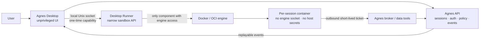

# Agnes Desktop: Agent Cockpit

**Date:** 2026-08-15

**Status:** product requirements draft

**Audience:** product, design, desktop, agent runtime, security, and API teams

**Supersedes:** the product scope, not the implementation contract, of
`../plans/2026-08-15-macos-desktop-mvp.md`

## Executive summary

The current macOS MVP proves native Marketplace browsing and a narrow one-shot
CLI bridge. It does not yet express what makes Agnes valuable: named agents,
durable analytical sessions, observable tool use, governed data access, or an
isolated workspace in which an agent can safely do useful work.

The next Agnes Desktop should be an **agent cockpit for technical users**. It
combines three ideas:

1. **Agent as code.** Every agent can be viewed, versioned, diffed, validated,
   exported, and applied as one Markdown file with typed YAML frontmatter and
   a prompt body. The UI form and code view edit one model, not parallel
   representations.
2. **Runs are inspectable.** Conversation is the main interaction, but each
   answer exposes a structured timeline of tool calls, permissions, data
   sources, files, artifacts, cost, and the exact effective agent config.
3. **Isolation is visible and managed.** Agnes continues to offer its existing
   server-side sandbox. A later local-runner mode lets the desktop manage a
   per-session Docker/OCI container without giving the agent the Docker socket,
   host credentials, or an implicit mount of the user's home directory.

This is inspired by Claude Code's interaction grammar—persistent composer,
resumable sessions, compact activity, explicit permissions, diffs, command
palette, and dense status—not by its terminal UI or visual identity. Agnes
keeps its own design system and makes data lineage, scope, and evidence more
prominent than shell mechanics.

## Product thesis

Technical users do not need more decorative chat. They need to answer four
questions at any point:

- **What agent am I running?** Its source, dependencies, model policy, budget,
  and immutable config snapshot.
- **What is it doing?** Its current step, tool inputs, data touched, files
  changed, resource use, and errors.
- **Why is it allowed?** The effective rule, its provenance, the requested
  exception, and the owner's live scope intersection.
- **Where is it running?** Remote or local, image digest, network policy,
  mounts, limits, lifecycle state, and cleanup status.

"Nerdy" therefore means **high information density, keyboard speed,
inspectability, reproducibility, and control**. It does not mean exposing raw
internal logs by default or making users operate Docker manually.

## Evidence and starting point

### What the current desktop proves

The existing client under `clients/macos/` already provides a useful native
shell, Marketplace and My Stack browsing, item detail, safe add/remove
confirmation, CLI health, and a one-shot Ask flow. Its documented constraints
are real:

- `agnes agent list --json` is an owner-management endpoint and rejects a PAT;
  it cannot power a desktop agent picker.
- `agnes chat --agent <slug> --once ... --json` is intentionally a one-shot
  escape hatch, not a durable session/event protocol.
- the current process runner serializes work through one CLI process boundary;
  that is a safe adapter, not a concurrency model for multiple live agents;
- the app does not own authentication, tokens, multi-turn history, agent
  management, signing, updates, or local isolation.

The vNext product must not hide those gaps behind more CLI parsing. The CLI
remains an escape hatch and parity surface; the interactive desktop moves to
typed APIs and replayable event streams.

### What the Agnes runtime already has

Agnes already contains most of the remote execution foundation:

- named agent profiles, live owner-scope intersection, config snapshots,
  budgets, agent memory policy, sessions, artifacts, and usage;
- multi-turn agent sessions and an AG-UI-compatible server-sent event stream;
- a server-side Docker provider with per-session lifecycle, resource limits,
  network modes, non-root execution, dropped capabilities, and
  `no-new-privileges`;
- an apps-runner sidecar that alone owns the Docker socket and exposes a
  narrow, token-protected sandbox API;
- short-lived broker tickets passed to a sandbox without placing raw service
  credentials in the container environment.

The desktop should reuse these contracts. It should not implement a second
agent loop, authorization engine, or general-purpose Docker API in Swift.

### What transfers from the Claude Code reference

The supplied Claude Code source snapshot demonstrates reusable product
patterns:

- a long-lived, virtualized transcript with a composer fixed at the bottom;
- resumable and forkable sessions with restored context;
- multiline input, prompt history, slash-command hints, and fuzzy search;
- compact, grouped tool activity with expandable details;
- concrete permission cards and an explanation of the rule that decided;
- structured diffs for mutations;
- a unified status/usage/config surface;
- file-backed agent authoring with Markdown/YAML and explicit source
  provenance. Agnes's immutable revision, deployment, visual round-trip, and
  apply/export model is a new Agnes design, not behavior attributed to the
  reference product.

We intentionally do **not** transfer terminal-only modality, raw Bash output
as the primary explanation, a global bypass-permissions switch, or coding
concepts that have no analytical meaning.

## Goals

1. Let a signed-in user find an agent and start a real multi-turn session in
   under one minute, without manually entering a slug.
2. Make an agent legible and reproducible as a code-reviewed artifact while
   preserving server-side policy as the enforcement boundary.
3. Make every run explainable through structured events, evidence, diffs,
   permission decisions, and an immutable config snapshot.
4. Make remote isolation visible and add an opt-in local container provider
   whose image, resources, network, mounts, recovery, and cleanup are managed
   by the desktop.
5. Preserve Marketplace as the easiest way to discover agent components, then
   connect installed agents, skills, and plugins to actual agent composition.
6. Offer keyboard-first speed without making the basic flow dependent on
   commands or shortcuts.

## Non-goals

- Reimplementing the Agnes agent runtime or data authorization in the desktop.
- Making the local container an offline LLM. Local execution still uses Agnes
  services for model access, governed data, policy, and durable session state.
- Letting an agent control Docker, mount the whole home directory, inherit host
  credentials, or request arbitrary privileged containers.
- Treating Docker alone as a perfect security boundary. It is the first local
  isolation tier; a managed VM/OCI backend can provide a stronger tier later.
- Turning Agnes into a full IDE or exposing every internal runtime event in the
  main transcript.
- Requiring local Docker for the first useful vNext release.
- Replacing Marketplace `AGENT.md` packages immediately. Instance-agent source
  and Marketplace package formats need an explicit, versioned conversion.
- Building collaborative source editing, Git hosting, pull requests, or a
  general terminal emulator into v1.

## Primary users and jobs

### Agent author

"I want to define an analyst agent in a file, review its effective privileges,
test it in isolation, and commit the change with the rest of my project."

Needs source editing, validation, server diff, provenance, test prompts,
explicit scopes, and safe apply/export.

### Technical analyst

"I want a durable working session, transparent SQL/tool activity, and outputs
I can inspect or export without guessing what the agent did."

Needs fast session switching, data lineage, artifacts, cost and freshness,
background runs, cancellation, and reproducible config.

### Platform/security owner

"I want agents useful on local projects without handing them the host or
secret-bearing credentials, and I need to understand every exception."

Needs effective-policy inspection, source provenance, immutable audit events,
container hardening, leases, cleanup, quotas, and diagnostics.

## Product principles

1. **Conversation is the control surface, events are the truth.** Chat remains
   approachable; typed run events power inspection, replay, and automation.
2. **Source and effective state are different views.** A manifest expresses
   desired state. The server validates it, intersects live owner grants, and
   returns the effective state that actually runs.
3. **Safe defaults, visible escape hatches.** No host mount, denied outbound
   network, selected data scope, proposed memory writes, and bounded resources
   are defaults. Broader access is explicit, scoped, and auditable.
4. **Progressive disclosure.** A tool call is one concise row until expanded.
   Raw JSON and logs exist for diagnosis, not as the default product language.
5. **Keyboard-first, never keyboard-only.** Every command has a visible native
   affordance and every visual action has a shortcut where useful.
6. **No secret-shaped config.** Agent source may reference a governed
   connection or secret by stable identifier; it never contains its value.
7. **One runtime contract, multiple providers.** Remote Docker, local Docker,
   and a future managed VM expose the same session, event, artifact, and
   permission semantics.

## Product domain model

The cockpit makes six related objects explicit instead of using "agent" or
"chat" for all of them:

1. **Agent Source** — the authored desired state with one explicit provenance:
   `project-managed`, `server-managed`, or `package-managed`.
2. **Agent Revision** — an immutable, normalized manifest, prompt, dependency
   lock, and content digest produced by successful validation.
3. **Deployment** — one revision activated on one Agnes instance, with
   resolved instance resource ids, effective policy, and server revision.
4. **Session** — a durable multi-turn conversation pinned to one agent
   revision and one spawn-time config snapshot.
5. **Run** — one turn, task, or retry attempt in a session, with a typed event
   stream and terminal state.
6. **Sandbox** — an ephemeral execution environment for one session. Runs in
   that session share only its pinned revision and declared workspace; unrelated
   sessions never reuse the container or its mutable state.

For a `project-managed` agent, Git source under `.agnes/agents/` is desired
state. A `server-managed` agent has a normalized exportable source view but no
pretend Git authority. A `package-managed` agent is pinned to its Marketplace
origin until explicitly forked. Converting provenance is a previewed action,
never an incidental edit. The server stores deployed projections and immutable
revision registry; it is not a second free-form editor for project-managed
agents.

A run pins a revision digest, so editing or applying source mid-run cannot
change its prompt, tools, image, or declared scopes. The server's live
authorization floor can still shrink that run immediately when the owner's
grant is revoked.

This model also resolves the current split between the builder and runtime
agent wire shapes. vNext must normalize both through one domain model before
adding a third desktop-specific representation.

## Information architecture

### Main window

Primary destinations are **Agents**, **Runs**, **Approvals**, **Library**
(Marketplace), **Infrastructure**, and **Settings**. Agents and Runs share the
cockpit below. Approvals is a global inbox for background sessions;
Infrastructure owns runner, image, cache, sandbox, and cleanup health.

The default workspace is a persistent three-column shell:

```text
┌──────────────────┬────────────────────────────────┬───────────────────────┐
│ Agents / Sessions│ Transcript                     │ Inspector             │
│                  │                                │                       │
│ Agent library    │ user + agent messages          │ Agent · Run · Data    │
│ Pinned/recent    │ compact activity rows          │ Files · Permissions   │
│ Session history  │ permission and diff cards      │ Sandbox               │
│                  │                                │                       │
│ Marketplace      ├────────────────────────────────┤                       │
│ Settings         │ Composer                       │                       │
└──────────────────┴────────────────────────────────┴───────────────────────┘
 model · config hash · scope · sandbox · tokens/cost · connection health
```

- Both side columns collapse independently. The center stays usable at the
  minimum supported width.
- The composer is fixed at the bottom. Background progress never moves focus
  away from it.
- The transcript is virtualized and restores position per session.
- The Inspector follows the selected message/activity/artifact but can be
  pinned to avoid context switching during comparison.
- A bottom status strip shows the active agent/model, config hash, effective
  scope summary, sandbox provider/state, token/cost budget, and connectivity.

### Visual direction

- Use Agnes typography, spacing, icons, and semantic colors; do not imitate a
  terminal window or another product's logo treatment.
- Default to a quiet high-contrast light or dark canvas. Use monospace for
  slugs, source, hashes, paths, SQL, identifiers, event names, and resource
  values—not for normal prose.
- Color communicates a small state vocabulary: running, waiting for approval,
  success, warning, failure, and policy denial. Every color also has text/icon.
- Optimize for density with an optional Comfortable/Dense setting. Dense mode
  reduces spacing and shows one extra metadata line; it does not remove labels.
- Syntax-highlight agent source, JSON, SQL, diffs, and logs with accessible
  themes and reduced-motion support.

## Core requirements

### 1. Agent Library

The left sidebar lists agents available to the signed-in owner. It must use a
desktop-compatible authenticated API; it must never depend on
`agnes agent list --json` under a PAT.

Each row shows display name, monospace slug, readiness, source badge, last
change, and running-session count. Search covers name, slug, description,
skills, and Marketplace origin. Filters cover Mine, Team, Marketplace,
Draft/Ready, and Local changes.

Selecting an agent opens a summary with:

- purpose, greeting, model policy, budget, skills/plugins, data connections,
  table and memory scope, surfaces, and latest usage;
- **Source** and **Effective** tabs;
- configuration provenance—project, user, team policy, Marketplace, or
  server-managed—and any shadowed value;
- actions: New session, Test, Edit visually, Edit source, Open in external
  editor, Export, Diff, Apply, Duplicate, and View in Marketplace.

The Effective tab is read-only and includes the generated prompt/rails,
resolved tools/skills, live scope intersection, policy decision sources,
runtime image, and `agent_config_hash`. The user can copy it as Markdown or
JSON for a bug report without copying credentials.

### 2. Agent as code

#### Canonical project representation

An instance agent can be represented as:

```text
.agnes/agents/<slug>/agent.md
```

The file is a declarative desired-state document. The YAML frontmatter is
typed configuration; the Markdown body is the author-controlled system
prompt. A proposed `v1alpha1` example:

```markdown
---
apiVersion: agnes.ai/v1alpha1
kind: Agent
metadata:
  name: revenue-analyst
  displayName: Revenue Analyst
  description: Explains recurring revenue movement with cited evidence.
spec:
  model:
    policy: inherit
    effort: medium
  budget:
    monthlyTokens: 2000000
  dependencies:
    skills:
      - revenue-analysis
    plugins:
      - charting
  data:
    tables:
      mode: selected
      include:
        - analytics.mrr_movements
    connections:
      mode: selected
      include:
        - warehouse-primary
    memoryDomains:
      mode: selected
      include:
        - finance-definitions
  memory:
    writeMode: propose
  permissions:
    tools:
      allow:
        - query_data
        - create_artifact
      ask:
        - export_data
      deny:
        - publish_external
  sandbox:
    providers:
      allow:
        - remote
        - local
      default: remote
    runtimeChannel: desktop-stable
    resources:
      cpus: 2
      memory: 4GiB
      disk: 10GiB
    network:
      mode: allowlist
      hosts:
        - api.agnes.example
    workspace:
      mode: snapshot
      persist: session
  surfaces:
    desktop: true
    api: true
---

# Role

You are a revenue analyst. Explain movements before recommending action.

# Output contract

State the date range, cite every data source, and separate facts from inference.
```

The example is illustrative until a schema review maps every field onto the
existing canonical agent model. Unsupported fields must fail validation; they
must not be silently ignored.

#### Source semantics

- The server database and authorization seams remain canonical for identity,
  grants, budgets, and enforcement. The file is never a security boundary.
- `metadata.name` is the stable human-managed key. Server ids and access tokens
  are not committed. A local state record may cache server id, revision, and
  content hash outside the source file.
- `apply` uses optimistic concurrency. If server revision changed since the
  last read, the user sees a three-way conflict and chooses or edits the
  result; last-writer-wins is forbidden.
- A successful apply returns the server revision, `agent_config_hash`, and a
  field-by-field Source → Validated → Effective diff.
- Imports default every capability dimension to `selected` or `deny`; omission
  never expands to all owner access.
- Symbolic references such as a connection slug resolve server-side and are
  checked against the owner. Unresolved, ambiguous, or unauthorized references
  are validation errors.
- Team policy can narrow a manifest. The Effective view names the policy and
  line/field it overrode; it never edits the source behind the user's back.
- Marketplace `AGENT.md` remains a distribution package. Installing or forking
  one produces an instance-agent manifest through an explicit conversion that
  previews dependencies and requested scope.
- In Local Beta a manifest selects only an organization-approved first-party
  runtime channel. The server resolves it to an allowlisted, signed image digest
  recorded in the immutable revision. Custom images and entrypoints are
  rejected regardless of signature and are reserved for a later supply-chain
  milestone.

#### Required parity surface

The schema and semantic validator must be shared by REST, CLI, and desktop.
Planned CLI verbs make the artifact usable outside the GUI:

```text
agnes agent init <slug>
agnes agent validate -f .agnes/agents/<slug>/agent.md
agnes agent diff -f .agnes/agents/<slug>/agent.md
agnes agent apply -f .agnes/agents/<slug>/agent.md
agnes agent export <slug> -o .agnes/agents/<slug>/agent.md
```

The desktop provides autocomplete, schema help, diagnostics with line/column,
formatting, structured diff, and visual/code round-trip tests. Unknown fields,
comments, and prompt Markdown survive a visual edit wherever semantics permit.

### 3. Sessions and transcript

- New session asks for agent, an available execution provider, and an optional
  project folder. Release 2 exposes Remote only; Local and Auto appear only
  after the server policy and local capability check make them usable.
- Sessions are named first-class objects with id, agent, project, provider,
  created/updated dates, status, and immutable spawn config hash.
- Users can resume, rename, pin, archive, fork, or delete a session, and cancel
  its active run. Forking records the parent and starts from a selected
  message/config state.
- Multi-turn messages stream as typed events. Reconnecting uses event ids and
  replay; it must not duplicate transcript items or lose a terminal state.
- The composer supports multiline input, prompt history at cursor boundaries,
  pasted text, file/data references, queued follow-ups, and draft recovery.
- Stop cancels the server run and preserves history. Closing the window does
  not silently cancel a background run.
- Every session exposes its config snapshot, effective scope snapshot, model,
  budget, provider, runtime version, and artifact manifest.

Session actions have explicit consequences:

| Action | Active run | Approval/ticket/sandbox | History and artifacts |
|---|---|---|---|
| Close window | Continues as background | Unchanged; Approvals inbox remains visible | Retained |
| Cancel run | Transitions to cancelled | Pending approvals deny, capabilities revoke, sandbox stops | Session and retained artifacts remain |
| Archive session | Refused until active/waiting run is cancelled or terminal | No live capability may remain | Hidden from default list; retained by policy |
| Delete session | Refused while a run is active/waiting | All session capabilities revoke; sandbox removal must converge | Transcript/artifacts enter declared deletion/retention workflow |
| Fork | Parent unchanged; new run starts in child session | New tickets and fresh sandbox | Parent lineage and selected snapshot recorded |

### 4. Run and tool activity

A `Run` is separate from a message and has a stable state machine:

```text
queued → preparing → running ↔ waiting_permission
                         ├→ succeeded
                         ├→ failed
                         └→ cancelled
```

The transcript renders compact semantic rows such as:

- `Queried 3 tables · 1.8M rows scanned · 4.2 s`
- `Created report.md · 18 KB`
- `Requested network access · api.example.com`
- `Sandbox started · local · image sha256:…`

Expanding a row opens structured input/output, duration, retry count, data
lineage, resource use, and redacted raw payload. Related reads/searches may be
grouped; writes, permissions, denials, errors, and policy changes are never
hidden in a group.

The Inspector's Run tab provides a chronological event list, current step,
elapsed time, tokens/cost, tool counts, warnings, and cancel/retry actions.
Retry creates a new run linked to the old one; history is append-only.

### 5. Permissions

This requires a new server-evaluated policy decision point before protected
tool execution. The existing approval behavior is not assumed to emit granular
file, network, data, or per-tool requests, and the local helper is never the
policy authority; it only enforces the host/container controls decided by the
server.

Permission requests are evidence-first cards. Each request names:

- the exact action and tool;
- affected files, tables, connections, memory domains, or network hosts;
- read/write/export semantics and estimated blast radius;
- data sensitivity, scan/cost estimate, and destination when available;
- the default policy and the rule/source that produced the request.

Choices are **Allow once**, **Allow for this session**, an optional
policy-permitted **Allow for this agent**, and **Deny**. Persistent permission
changes require a previewed agent/policy diff and separate confirmation.
**Allow for this agent** never mutates a running revision: it creates a draft
revision with the proposed rule and requires an authorized owner to apply it.
The current request is still decided only once or for the current session.

There is no global "bypass all permissions" switch. Organization policy and
the owner's live grants cannot be weakened by the manifest, desktop, local
runner, or a remembered decision. Every decision is timestamped and auditable.
Unattended or expired approval requests resolve to deny. Pending approvals from
background runs also appear in the global Approvals inbox.

### 6. Data and evidence inspector

For analytical runs the Data tab is more important than raw shell output. It
shows:

- tables, semantic models, metrics, connections, and memory domains used;
- query text/dialect, start/end time, duration, rows/bytes scanned, result
  shape, and freshness when known;
- evidence links from claims in the answer to the producing query/artifact;
- whether each source was declared, dynamically granted, or denied;
- a safe preview with sensitivity and truncation indicators.

Copy SQL, Open in catalog, Save as artifact, and Re-run are explicit actions.
Raw data is never placed in diagnostic bundles by default.

### 7. Files, changes, and artifacts

- File creation/update appears as a structured diff with path, line numbers,
  encoding, size, and approval state.
- A new file uses a preview; an update uses a diff. Binary outputs show typed
  metadata and Quick Look where supported.
- For a Git project, access defaults to an isolated worktree below an
  Agnes-owned root. For a non-Git folder it defaults to **Snapshot**. Both
  return a patch/artifacts and leave the original host folder unchanged.
- Read-only mount is an explicit alternative. Direct read-write host mounts are
  excluded from Local Beta; adding them later requires a separate threat model
  and organization policy.
- Paths are canonicalized; symlink and archive traversal outside the approved
  root fails closed.
- Artifacts survive container deletion according to server retention policy
  and can be exported by deliberate user action.
- Artifact synchronization is allowlist-based by output root, type, size, and
  hash. It never uploads an entire workspace automatically; server policy and
  data-loss-prevention checks authorize each artifact namespace, and cancelled
  uploads are cleaned up.

### 8. Marketplace composition

Marketplace remains a top-level destination but becomes part of the agent
workflow:

- Add to stack remains available with the current confirmation contract.
- An agent item can be **Run**, **Install**, or **Fork as editable**. The user
  previews prompt, dependencies, requested tools/data/network, source, review
  status, and version.
- Skills and plugins show which agents depend on them and whether an available
  update changes requested permissions.
- An agent manifest can pin dependency versions/digests for reproducibility or
  follow an approved channel. Updates always show a semantic diff.
- The existing activation handoff remains until Marketplace and runtime share
  a direct installation contract; the desktop must not imply that stack
  membership alone changed an already-running sandbox.

### 9. Command palette and shortcuts

`⌘K` searches a single registry of agents, sessions, Marketplace items,
datasets, artifacts, settings, and actions. `/` in the composer filters the
same registry to conversational commands. Initial commands:

```text
/agent       switch or inspect agent
/fork        fork from the current point
/permissions inspect effective rules
/sandbox     inspect or change provider for the next session
/usage       show session and agent budget
/export      export transcript or artifact
/clear       clear composer, never delete history
```

Suggested shortcuts: `⌘N` new session, `⌘⇧N` fork, `⌘1/2/3` focus columns,
`⌘.` stop run, `⌥⌘I` toggle Inspector, `⌘⇧P` permissions, and `⌘,` settings.
All are discoverable in menus and remappable where macOS conventions permit.

### 10. Status, usage, and diagnostics

One diagnostics surface covers:

- app, CLI, API, schema, runner, and runtime-image versions;
- signed-in server/account, stream and Marketplace health;
- agent/model/config hash and effective scope summary;
- remote/local sandbox readiness, engine, image digest, resources, network,
  mounts, last heartbeat, and cleanup queue;
- session/agent token and cost usage against budget;
- a redacted exportable support bundle with an explicit preview.

The CLI path is still shown for escape-hatch workflows, but CLI availability
does not stand in for API authentication or session health.

## Managed sandbox architecture

### Product modes

1. **Remote** — the existing server-side sandbox. Recommended default and the
   first vNext implementation. Desktop visualizes state and controls allowed
   lifecycle actions through the server.
2. **Local container (Beta)** — requires a compatible local engine initially.
   Agnes manages image pull/verification, per-session containers, resources,
   policy, logs, recovery, and pruning. Pause is only a best-effort warm
   suspension within one healthy engine lifetime, never a durable process
   resume guarantee. The user does not run Docker commands.
3. **Managed runtime (future)** — a bundled, app-managed lightweight Linux VM
   and OCI runtime removes the external-engine prerequisite and offers a
   stronger boundary. It implements the same provider contract.

Remote remains the default throughout Local Beta. "Auto" may choose a healthy
local provider only after explicit user and organization opt-in and a passing
capability check; otherwise it uses Remote and explains the decision. An
explicit Local choice fails closed and never silently falls back to Remote.

### Boundaries



The Swift UI never exposes a raw Docker endpoint. A signed per-user background
helper, `agnes-desktopd`, owns local file watching, isolated worktrees,
run journal, artifact/diff plumbing, and the narrow sandbox runner. It is not a
second agent loop.

Local execution is nevertheless a new runtime boundary, not the existing
server Docker provider pointed at another socket. The server must implement an
explicit `desktop`/foreign-executor provider with provider-scoped sandbox ids,
server-owned lease state, launch acknowledgements, heartbeats, terminal
acknowledgements, and reaper behavior. It reuses the existing agent principal,
live authorization, broker, ChatManager orchestration, and event vocabulary;
it does not assume the gateway and helper share a host or mount namespace.

The server is the sole owner of Session, Run, authorization, audit event log,
and terminal state. `agnes-desktopd` realizes signed desired state and reports
idempotent observations; it cannot declare an authoritative success, grant, or
data-access event. Broker/data services author data, usage, and audit facts;
the helper authors only local image, mount, resource, and lifecycle facts.
Agent-emitted telemetry is labeled untrusted until corroborated by one of those
authorities.

The helper is the only local component allowed to reach the engine. It listens
only on a user-owned Unix socket, authenticates every request with a rotating
capability, and exposes a narrow
create/attach/stdin/pause/resume/remove/status contract.

### Local launch flow

1. Desktop creates an Agnes session and requests a single-use local-execution
   launch ticket bound to audience, instance, account, agent, session, runner
   public key, scope/config version, expiry, nonce (`jti`), and one image
   digest. Scope inside the ticket is context, not authorization.
2. Desktop passes the opaque ticket to the runner over local IPC. It does not
   put the ticket in argv or a persistent config file.
3. Runner atomically redeems the ticket, validates policy, prepares an isolated
   session directory, receives a single-run bootstrap capability, and starts
   the pinned image with hardening and quotas.
4. The bootstrap capability enters through stdin. The container connects to an
   authenticated loopback capability relay, which exchanges it for narrower,
   short-lived, route-allowlisted broker capabilities. The relay is not a
   general server proxy and applies rate, request-size, and response-size
   limits.
5. Structured events go to the server session stream. The desktop can close
   and replay them later; the runner sends a lease heartbeat.
6. On completion, allowed artifacts are synchronized, the container is
   removed, and the session directory is retained or erased by declared
   policy. Crash recovery reconciles only resources carrying Agnes labels.

The visible lifecycle is:

```text
unavailable → validating → pulling → ready → creating → booting → running
                                                        ↕
                                               waiting_permission
running → archiving → destroyed
```

`failed`, `orphaned`, and `quarantined` are explicit side states. `paused` is
only a warm-cache optimization; after helper, engine, or machine restart the
session is restored from server history into a fresh sandbox, not represented
as if an in-memory container had survived.

Cancel, logout, account removal, terminal state, and any pause/resume ticket
rotation revoke the prior launch/broker capabilities. Every broker/data/MCP
request reloads the live owner and agent grants; possession of a redeemed
launch ticket can never preserve revoked scope.

### Mandatory container policy

- helper IPC lives below a `0700` parent with a `0600` socket, validates macOS
  peer credentials/audit token and expected code-signing team identity, and
  accepts the smallest closed request schema. A same-uid malicious process is
  not assumed harmless; reusable bearer capabilities never enter logs;
- one container and isolated workspace per session; no reuse across unrelated
  sessions or agents;
- non-root uid, read-only root filesystem where compatible, tmpfs for ephemeral
  state, all capabilities dropped, `no-new-privileges`, no privileged mode,
  host devices, host PID/IPC/network namespaces, or engine socket mount;
- explicit CPU, memory, pids, disk, wall-time, output, and concurrent-container
  limits. `doctor` publishes an enforcement capability matrix per engine;
  unsupported controls, including a real per-session disk quota, fail closed
  rather than degrading to monitoring;
- the helper derives command, environment, mounts, engine options, and network
  from a validated signed launch bundle. Neither a manifest nor Swift caller
  can submit an arbitrary Docker create/exec payload or raw host path;
- deny-by-default outbound network with domain allowlist through an audited
  proxy; no implicit host-gateway access or general-purpose
  `host.docker.internal` route;
- the container joins only an internal network. A dual-homed proxy rejects
  direct routes, IP literals, private/link-local/metadata ranges, unsupported
  CONNECT targets, and IPv4/IPv6 bypasses; it resolves and rechecks the final IP
  immediately before connect to resist DNS rebinding;
- no raw user PAT, model key, database credential, SSH agent, cloud credential,
  shell history, or host environment in the container;
- only a first-party allowlisted image digest may start in Beta. The helper
  verifies signature/provenance against an organization-configured trust root
  before create, applies vulnerability and staleness policy to cached images,
  exposes the SBOM, and supports explicit update/rollback channels;
- Local Beta uses a new immutable desktop runtime image and boot protocol. It
  must not assume the current remote image's writable `/usr/local`, writable
  home, host session bind mount, or per-spawn package installation;
- worktrees/snapshots are materialized before spawn from semantic mount intents,
  never manifest-supplied host paths. Worktree creation disables hooks and
  treats submodules, Git config, special files, and ignored credential folders
  as hostile input;
- bounded, structured, redacted logs; secret patterns and data previews are
  excluded from routine support bundles;
- idempotent lifecycle, heartbeats and leases, startup reconciliation, and
  orphan detection. Cleanup requires an installation-specific random owner
  nonce plus a signed run record, exact container id, and server lease—not a
  public label alone;
- a visible downgrade warning when a local engine cannot enforce a requested
  control. The runner fails closed instead of silently dropping policy.
- missing engine/image or failed policy enforcement blocks a Local run with a
  concrete repair path. There is never an unsandboxed fallback.

### Threat-model boundary

Local Beta must defend against malicious or prompt-injected agent code,
malformed manifests and archives, hostile repository content, network
exfiltration, resource exhaustion, stolen/replayed run capabilities, a second
same-uid process attempting IPC, app/helper/engine crashes, and stale or forged
cleanup metadata. The container, its output, and its self-reported telemetry are
untrusted.

It does not claim protection from a compromised macOS kernel, an already
compromised container daemon/VM, a hostile administrator/root user, or physical
device compromise. A stronger managed VM reduces—but does not erase—those
boundaries. UI copy and security documentation must not describe Docker as safe
for arbitrary hostile multi-tenant code.

## Authentication and authorization

The desktop needs a first-party sign-in flow that opens the system browser and
stores only the resulting refresh/access material in macOS Keychain. Importing
or scraping browser cookies is forbidden. Reusing CLI login may remain a
development bootstrap, but it is not the long-term desktop security model.

Authorization remains server-owned:

```text
effective capability = live owner grants ∩ agent declaration ∩ organization policy
```

- The intersection is evaluated at session start and again at each protected
  tool/broker boundary, so revocation can only shrink a live session.
- The immutable spawn snapshot explains reproducibility; the live effective
  view explains current safety. Both are visible.
- A local runner cannot mint or broaden broker tickets.
- Remembered approvals cannot outlive the grant or policy that permitted them.
- Agent memory writes default to `propose`; provenance and source session are
  visible before activation.
- Logout or account removal revokes launch/broker capabilities, stops local
  sandboxes, and applies the chosen encrypted-local-state retention/deletion
  policy to that account's workspaces, caches, and journals.

## API and CLI gaps

The product requires typed contracts; parsing human CLI output is not an
acceptable substitute.

### Desktop API

- browser-based desktop authorization with refresh/revoke and Keychain-safe
  token semantics;
- list/read/create/update agents for the signed-in owner, with revision/ETag,
  schema, validate, diff, apply, export, provenance, and effective config;
- list/create/read/fork/cancel/archive sessions and runs;
- replayable event stream with stable event ids, reconnect cursor, typed tool,
  permission, usage, artifact, sandbox, and terminal events;
- submit permission decisions with allowed scopes and policy provenance;
- list/download artifacts and safe previews;
- sandbox provider selection, remote status/control, local launch-ticket
  issuance, runner registration/lease, and redacted diagnostics;
- Marketplace browse/detail/stack/install semantics that do not require
  spawning a CLI process for every read.

### Event contract

All event envelopes include `event_id`, `session_id`, `run_id`, timestamp,
run-scoped monotonic `sequence`, idempotency key, optional
`caused_by_event_id`, schema version, and redaction/authority classification.
Tool and approval lifecycles carry stable `tool_call_id` and
`permission_request_id`. Payloads use a closed discriminated union such as:

```text
run.queued | run.started | run.completed | run.failed | run.cancelled
message.delta | message.completed
tool.started | tool.progress | tool.completed | tool.failed
permission.requested | permission.decided
artifact.created | file.diff
usage.updated | scope.changed
sandbox.preparing | sandbox.ready | sandbox.warning | sandbox.stopped
```

Unknown future events remain inspectable as raw redacted JSON but do not break
the stream. On reconnect the client sends its last committed cursor, receives
an authoritative session/run snapshot, then replays strictly after that cursor.
Events from concurrent runs interleave only through their independent
run-scoped sequences; causal ids connect progress/result and permission/tool
pairs. Terminal events are idempotent. Reconnect tests cover gaps, duplicates,
reordering, partial snapshots, and schema evolution.

### CLI parity

In addition to agent source verbs, planned parity includes:

```text
agnes session list|show|watch|fork|cancel
agnes sandbox status|doctor|logs|prune
agnes marketplace diff <item-id>
```

Desktop can display a copyable equivalent CLI command for a safe read action.
It never constructs shell strings or includes credentials in argv.

## Delivery plan

### Release 0 — current Marketplace MVP

Preserve the existing Marketplace-first client as a working baseline. Fixes
may continue, but do not expand its one-shot CLI adapter into the foundation
for sessions.

### Release 1 — Contract foundation

- normalize the builder and runtime agent wire shapes through one domain
  model;
- immutable agent revisions, deployment pointer, content digest, and compiler
  from the manifest into the existing agent/scope model;
- final normalized AST for `v1alpha1`, desktop sign-in, typed agent API, shared
  schema/semantic validator, golden CLI/API parity tests, and optimistic
  concurrency;
- versioned, replayable session/run event contract;
- keep the existing CLI process adapter only as a recovery and development
  escape hatch.

This foundation lands before the cockpit editor so Git, builder, server, and
desktop cannot become four competing sources of truth.

### Release 2 — Agent Cockpit core

- three-column shell, Agent Library, multi-turn sessions, replayable streaming,
  composer, session resume/cancel, compact activity, status strip;
- Source/Effective read-only views and config snapshots;
- minimum read-only Run/Data provenance and remote sandbox state in Inspector;
- a new server-evaluated pre-tool policy decision point plus minimum
  **Allow once**, **Deny**, and timeout-to-deny UI for real approval events;
- Marketplace and Settings carried forward.

This is the first release that should replace the current Ask screen.

### Release 3 — Evidence and approvals

- complete Run/Data/Files/Permissions inspectors;
- scoped approval cards and global inbox with rule provenance;
- structured SQL, evidence, query cost/freshness, file diffs, artifacts;
- fork, background runs, command palette, usage, and support bundle.

### Release 4 — Agent authoring

- visual/source lossless round-trip editor over the Release 1 schema/compiler;
- init/export/validate/diff/apply with optimistic concurrency;
- permission and dependency diffs;
- external-editor handoff and project-local discovery;
- Marketplace agent → instance-agent conversion.

### Release 5 — Local runtime core

- signed `agnes-desktopd` helper and narrow IPC;
- server-recognized desktop executor, leases, acknowledgements, tickets, and
  authoritative event integration;
- compatible-engine detection and doctor;
- first-party pinned runtime image, scratch-only workspace, no external egress,
  resource policy, crash recovery, and nonce-bound orphan cleanup;
- no project access or automatic artifact upload in this slice.

### Release 6 — Project sandbox Beta

- isolated Git worktree/Snapshot project modes and immutable mount plan;
- controlled egress proxy, artifact/DLP sync, diffs and explicit export/apply;
- capability-matrix enforcement, two-session isolation, reboot/logout recovery;
- threat-model review and opt-in beta gate.

### Release 7 — Managed runtime

- bundled VM/OCI backend with zero external-engine setup;
- stronger isolation profile, upgrades/rollback, disk management, and migration
  from compatible-engine mode;
- organization controls for provider, image, network, and project mounts.

## Acceptance criteria by milestone

### Agent Cockpit core

- A signed-in user can select a real agent without typing a slug, create a
  session, exchange at least five turns, quit, relaunch, resume, and cancel a
  run without losing or duplicating events.
- Every response is linked to a run, config hash, effective scope snapshot,
  provider, usage, and terminal state.
- The desktop never invokes `agnes agent list --json` for its picker and does
  not parse terminal prose to infer run state.
- Remote sandbox status and failures are distinguishable from API, auth,
  Marketplace, empty-agent, and network states.
- Keyboard-only and VoiceOver paths cover agent selection, composer, run stop,
  activity expansion, permission decisions, and Inspector navigation.

### Agent as code

- A successful apply creates an immutable revision digest and moves the
  deployment pointer. A run pins that digest; changing the source or active
  deployment cannot mutate prompt, tools, image, dependencies, or declared
  scope for an in-flight run. Live revocation still narrows access on its next
  protected request.
- A manifest round-trips visual → source → visual without semantic drift;
  prompt body, supported comments, and unknown-but-preserved extension fields
  survive or produce an explicit diagnostic.
- Validation reports exact file/line/field, rejects secrets and unknown core
  fields, and resolves every symbolic dependency against visible owner scope.
- Diff distinguishes desired, current server, policy-narrowed, and effective
  values. Apply cannot overwrite a newer revision without resolving conflict.
- Exported source contains no credential value, server session token, local
  absolute path, or organization-only secret material.
- CLI and desktop validator golden tests produce the same normalized model and
  errors.

### Local container Beta

- The agent container has no Docker/engine socket, host credential material,
  implicit home mount, privileged capability, or unapproved network path.
- Two concurrent sessions use distinct worktrees/snapshots, containers,
  writable caches, launch tickets, and artifact namespaces.
- Resource, network, mount, image, and time policies are enforced or startup
  fails closed with a specific diagnostic.
- Cached-image sandbox-ready latency is measured; a launch, app crash, runner
  restart, cancellation, and daemon restart all converge to one correct
  session/container state.
- Expired launch and broker tickets cannot be replayed for a new session,
  agent, account, image, or broader effective scope.
- Cleanup requires the installation nonce, signed run record, exact resource
  id, and matching server lease. User-owned containers, images, volumes, and
  folders are never pruned.
- Cancellation revokes session capabilities and converges to a stopped,
  container-removed state within a measured launch SLO; app, helper, or engine
  restart cannot falsely report a paused container as a resumable session.
- A security review covers container escape assumptions, IPC authentication,
  image supply chain, path traversal, network rebinding/exfiltration, prompt
  injection, secret leakage, runaway resources, and memory poisoning.

## Success measures

### Product

- median time from successful sign-in to first completed real-agent run;
- percentage of sessions resumed or forked instead of recreated;
- percentage of active agents exported to or discovered from project source;
- successful validate → diff → apply funnel and conflict-resolution rate;
- permission decision rate, denial rate, repeated-prompt rate, and time waiting
  for approval;
- Marketplace install/fork → first successful run conversion;
- weekly users of Run/Data/Files inspectors and command palette.

### Reliability and safety

- session event reconnect correctness and terminal-state convergence;
- sandbox-ready latency split by provider and cached/uncached image;
- orphan-container count and cleanup latency;
- runner crash-free sessions and local-to-remote fallback rate;
- count of secret-redaction failures, policy downgrades, unexpected network
  attempts, and blocked out-of-root path accesses;
- support bundles reviewed before export and rate of successful diagnosis.

Launch SLOs and adoption targets should be set after instrumenting Release 2;
security invariants are release gates, not aspirational metrics.

## Risks and mitigations

| Risk | Mitigation |
|---|---|
| The app becomes a generic chat client | Center product requirements on agent source, runs, evidence, permissions, and sandbox state; measure inspector use and reproducibility. |
| Code view and visual editor drift | One parsed AST, shared schema/validator, lossless round-trip fixtures, structured patches instead of string templating. |
| Users mistake desired source for effective authority | Persistent Source/Effective distinction, policy provenance, config/scope snapshots, server-side validation and live enforcement. |
| Local Docker is treated as a perfect sandbox | Name the tier honestly, harden it, expose downgrade warnings, keep Remote default, and plan a managed VM backend. |
| Docker socket access turns the helper into a host-control API | User-owned Unix socket, rotating capability, narrow allowlisted operations, fixed labels/images/options, no arbitrary create/exec payload. |
| Project mount leaks or destroys host files | Isolated worktree for Git and Snapshot otherwise, optional read-only mount, no direct read-write host mount in Beta, canonical paths, DLP-aware artifacts, diffs and explicit apply/export. |
| Prompt injection drives exfiltration or persistent poisoning | Live scoped broker, deny-by-default network, evidence-first permission gates, proposed memory writes, provenance and audit. |
| App quit or network loss corrupts state | Server-owned event log, idempotent terminal events, runner leases, startup reconciliation, durable artifacts. |
| New APIs fragment web/CLI/desktop | Shared typed domain contracts and parity tests; desktop-specific auth/IPC only at the edge. |
| Dense UX overwhelms new users | Progressive disclosure, comfortable default, guided first run, clear empty states, visible controls alongside shortcuts. |
| Marketplace package and instance manifest are conflated | Separate versioned schemas and an explicit install/fork conversion with semantic diff. |

## Open decisions

1. Should Agnes support a user-global source directory in addition to the
   settled project location `.agnes/agents/<slug>/agent.md`, and if so what is
   its explicit precedence and provenance UI?
2. Which frontmatter fields are v1 core versus namespaced extensions, and how
   do Marketplace `AGENT.md` fields map without ambiguity?
3. What desktop authorization flow can be supported by existing deployments,
   and what is the transition from CLI-authenticated development builds?
4. Which session/run/event endpoints are stable enough to expose directly and
   which need a desktop-facing compatibility layer?
5. Should local execution be allowed for all agents, or only agents with a
   project/file workload and an organization policy opt-in?
6. Which compatible engines are supported in Beta, and what enforcement
   capabilities must an engine advertise before it is selectable?
7. Is Snapshot workspace synchronization patch-based, artifact-based, or both?
   How are large repositories, ignored files, and LFS handled?
8. What is the exact signed launch-plan schema and push/poll transport for the
   settled server-owned desktop-executor provider?
9. Which events and data previews can be retained locally, for how long, and
   under which enterprise data-loss-prevention policy?
10. Which stronger macOS isolation backend should follow Docker-compatible
    Beta: Virtualization.framework-managed Linux VM, a third-party rootless
    runtime, or both behind one provider interface?

## Source evidence appendix

These paths are research evidence, not runtime dependencies. Claude Code paths
refer to the source snapshot supplied for product research; no source is copied.

### Agnes

- `clients/macos/README.md` — current MVP and PAT/CLI boundaries.
- `clients/macos/Sources/AgnesDesktop/Views/ContentView.swift` — current
  Marketplace/Ask/Settings navigation.
- `clients/macos/Sources/AgnesDesktop/Views/ChatWorkspaceView.swift` — current
  manual-slug, one-shot Ask experience.
- `clients/macos/Sources/AgnesDesktop/Services/SystemAgnesCLIProcessRunner.swift`
  and `clients/macos/Sources/AgnesDesktop/ViewModels/AppModel.swift` — current
  serialized CLI process boundary.
- `cli/commands/agent.py` — management auth, agent CRUD/scope/usage, and CLI
  constraints.
- `app/api/agents.py` and `src/repositories/agents.py` — canonical profile
  fields and builder adapter.
- `app/api/agent_sessions.py` and `app/api/agent_sse.py` — multi-turn session
  and streaming-event foundation.
- `app/chat/agent_profile.py` — persona materialization and live data-access
  rails.
- `app/chat/docker_provider.py` — existing per-session remote Docker provider.
- `services/apps_runner/sandbox_api.py` — narrow Docker-owning sidecar,
  lifecycle, mount and hardening contract.
- `app/chat/sandbox_runner_client.py` — gateway-to-runner boundary.
- `services/egress_proxy/` — existing DNS/IP revalidation and controlled-egress
  foundation.
- `docs/superpowers/specs/2026-07-21-agent-profiles-and-agent-api-design.md` —
  agent scope, session, budget, memory, artifact, and security decisions.

### Claude Code reference snapshot

- `claude-code/src/screens/REPL.tsx` and
  `claude-code/src/screens/ResumeConversation.tsx` — persistent transcript,
  session resume/fork, and restored context.
- `claude-code/src/components/PromptInput/PromptInput.tsx` and
  `PromptInputFooterSuggestions.tsx` — composer and command discovery.
- `claude-code/src/components/Messages.tsx` and
  `claude-code/src/tools/BashTool/UI.tsx` — compact/grouped activity.
- `claude-code/src/components/permissions/FallbackPermissionRequest.tsx` and
  `PermissionDecisionDebugInfo.tsx` — scoped approval and decision provenance.
- `claude-code/src/tools/FileEditTool/UI.tsx` and
  `claude-code/src/components/StructuredDiff.tsx` — previews and diffs.
- `claude-code/src/components/agents/agentFileUtils.ts` and
  `claude-code/src/tools/AgentTool/loadAgentsDir.ts` — agent-as-Markdown schema,
  source provenance, and file lifecycle.
- `claude-code/src/components/tasks/BackgroundTasksDialog.tsx` and
  `AsyncAgentDetailDialog.tsx` — task state, detail, elapsed time, and tool/token
  counts.
- `claude-code/src/components/StatusLine.tsx` and
  `claude-code/src/components/Settings/Status.tsx` — compact runtime status and
  diagnostics.
